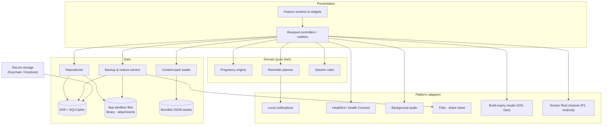
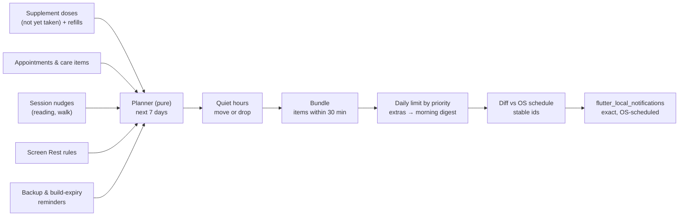
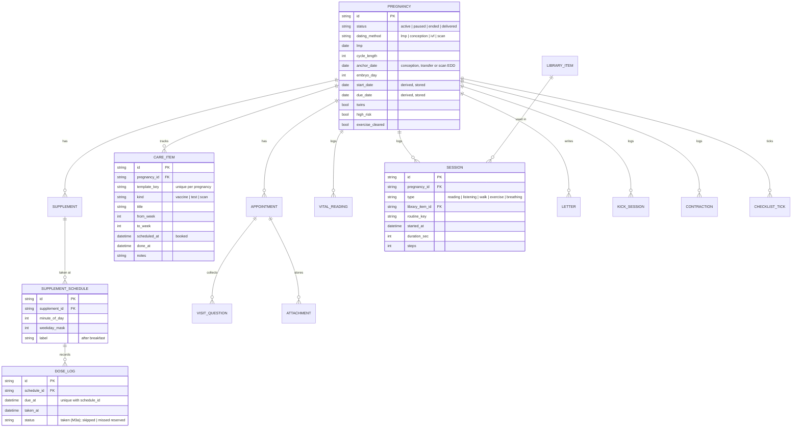

# Navmaas — Architecture Design

| | |
|---|---|
| **Status** | v10 — updated 2026-10-06 (M5 complete: M5a schema v6, kick counter, contraction timer, pause or end tracking, iPhone build expiry, the one wall clock `clockNow`; M5b backup and restore) |
| **Stack** | Flutter (stable) · Dart 3 |
| **Inputs** | [Plan](PLAN.md) · [Design system](DESIGN_SYSTEM.md) · [Prototype](https://claude.ai/artifact/SQRrhaQU7odSc5FLNeKcJ8) |

## 1. Context and constraints

| Constraint | Consequence for the design |
|---|---|
| Personal use, free | No accounts, payments, analytics or backend |
| Tracking aid, no medical reviewer | Domain logic records and reminds; it never interprets readings |
| No SOS / emergency features | Emergencies are handled manually, as the doctor advises. The app has no emergency calls, location sharing or danger-sign content |
| Owner supplies Garbhasanskar content | In-app import of PDF, text and audio, stored on the device |
| Public MIT repository | Only original or public-domain content in `assets/`; no secrets in the repo |
| India, English only | `en` strings through `gen-l10n` (ready for more later); India care template |
| iPhone signed with a **free Apple ID** | Only capabilities available to a personal team; the build expires every 7 days, so the app warns before expiry (§12) |
| No cloud | Password-protected backup file is the only way data survives a lost or wiped phone (§11) |
| Calm, low-screen product | Audio-first sessions, a notification budget, quiet hours, Screen Rest |
| Low-end Android phones | Small app size, no background polling in the MVP, offline-first |

**Non-functional targets**

- Cold start under 2 s on a 3 GB-RAM Android phone.
- Release APK at most 100 MB (the owner's limit). Since M4a the phone build is Arm only (`--target-platform android-arm,android-arm64`, about 65 MB); the universal APK, which adds x86_64 for emulators, is about 101 MB since M4b (Health Connect), so it is for emulators only, and `--split-per-abi` gives about 30 MB per phone. PDFium (the PDF engine) is about 5 MB per ABI.
- 100 % offline.
- No network calls.
- Every screen usable at 200 % text size and with TalkBack / VoiceOver.
- Backup of a 500 MB library streams in under 50 MB of RAM (measured in M5b: +32 MB at peak).

## 2. Architecture at a glance



- **One Flutter app, no server.** All state lives in an encrypted SQLite database plus files in the app sandbox.
- **Domain is pure Dart.** The pregnancy engine and the reminder planner have no Flutter imports, so they are fast to unit-test.
- **Platform adapters sit behind interfaces**, so tests can use fakes.

## 3. Tech stack

| Concern | Choice | Notes |
|---|---|---|
| Framework | Flutter stable, Dart 3 | Material 3 with custom tokens |
| State & DI | `flutter_riverpod` (+ `riverpod_generator`) | Compile-safe providers, easy overrides in tests |
| Navigation | `go_router` | `StatefulShellRoute` for the 5 tabs, keeping each tab's stack |
| Database | `drift` + `sqlite3` (SQLCipher build) | Typed SQL, migrations, reactive streams, encrypted at rest. `sqlcipher_flutter_libs` is end-of-life, so `pubspec.yaml` selects SQLCipher with `hooks: user_defines: sqlite3: source: sqlcipher`. The binary is fetched and checksum-verified at build time only |
| Files | `path_provider` | App support folder that holds the database |
| Secrets | `flutter_secure_storage` | Holds the random 256-bit DB and attachment keys |
| Models | Plain Dart classes, hand-written `fromJson` | One small content-pack model; a test loads the real `weeks.json`, so code generators (`freezed`, `json_serializable`) aren't needed |
| Icons | `path_parsing` (flutter.dev) | Turns the prototype's SVG path data into Flutter paths, so its own line icons are drawn exactly |
| Notifications | `flutter_local_notifications` + `timezone` + `flutter_timezone` | Local reminders scheduled with the OS (exact alarms on Android), no push. `timezone` lists `http` for its own data-download script; the app never calls it (ADR 020) |
| Health | `health` | M4b. Reads steps from HealthKit and Health Connect; never writes (ADR 030) |
| Audio | `just_audio` + `audio_service` | Background playback, lock-screen controls, sleep timer (M4a). `audio_service` brings a download cache (`flutter_cache_manager` → `http`, `sqflite`) that Navmaas never calls (ADR 026) |
| Reading | `pdfrx` for PDF; built-in renderer for text/Markdown | M4a. PDFium is fetched at build time only. EPUB later (Plan decision 24) |
| Import / export | `file_picker` (open), `image_picker`, `share_plus` | Books and audio (`file_picker`, M4a); backup files are opened with `file_picker` and saved through the share sheet (`share_plus`, M5b), because `file_picker`'s save dialog needs the whole file in memory; `image_picker` (M3b) takes or chooses prescription photos through the system camera and photo picker, so no camera permission is declared |
| Backup | `cryptography` (Argon2id, ChaCha20-Poly1305) | See §11. The body is a simple stream of files, so `archive` isn't needed (Plan decision 33). `cryptography` also encrypts attachments with AES-256-GCM (M3b, §13) |
| Device | `url_launcher` | "Call clinic" opens the dialler; "Directions" opens Apple Maps or Google Maps on iPhone and the maps app on Android (ADR 024) |
| Security | `local_auth` (optional app lock) | |
| Utilities | `intl`, `uuid` (v7), `collection` | |
| Lints & tests | `very_good_analysis`, `flutter_test`, `mocktail` (when a fake needs it), `integration_test` | Golden tests for light/dark |
| Native | Swift platform channel `navmaas/files` (M1, keeps the database out of iOS backups); `home_widget` + Kotlin Screen Rest channel (P2) | The build expiry (M5a) is read in Dart from the app bundle, so it needs no channel (ADR 033) |

Versions are pinned in `pubspec.lock`. M1 started on Flutter 3.47.3 / Dart 3.13.3 with the latest stable packages; upgrades are deliberate.

## 4. Project structure

Feature-first. Screens and widgets live in `lib/features/<feature>/`. A feature adds `data/` (repositories, table access), `domain/` (models, pure logic) and `presentation/` (screens, widgets, controllers) subfolders once it has more than screens. Tables used by several features (`pregnancy`, `settings`) live with their repositories in `core/db/`.

```
pregnancy-care/
├─ lib/
│  ├─ main.dart
│  ├─ app/                 # NavmaasApp, router, tab bar, theme mode, reminder sync + actions
│  ├─ core/
│  │  ├─ theme/            # AppTheme (tokens → ThemeData light/dark), NavmaasColors, brand mark, prototype icons
│  │  ├─ db/               # drift database, tables, key handling, attachment store, shared repositories
│  │  ├─ pregnancy/        # pregnancy engine (pure Dart)
│  │  ├─ reminders/        # planner (pure), scheduler adapter, calm-notification settings, data reminders (build expiry)
│  │  ├─ content/          # content-pack loaders (weeks, India care template, daily activities)
│  │  ├─ widgets/          # shared widgets: pill segmented control, step button, icon motion, amber notice
│  │  ├─ platform/         # audio playback (M4a), steps (M4b), iPhone build expiry (M5a); later screen-rest channel
│  │  └─ utils/            # clockNow, todayProvider / nowProvider (clock), date-only maths and formatting
│  ├─ features/
│  │  ├─ onboarding/
│  │  ├─ today/            # today screen, today's plan card
│  │  ├─ journey/          # journey screen; data/ checklist repository
│  │  ├─ sessions/         # data/ presentation/: library, reader, listen, letters, path (M4a); walk, exercise, breathing (M4b)
│  │  ├─ care/             # data/ domain/ presentation/: supplements (M3a); vaccines & tests, visits, vitals (M3b)
│  │  ├─ third_trimester/  # data/ domain/ presentation/: kick counter, contraction timer, her patterns (M5a)
│  │  ├─ backup/           # data/: the .navmaas file format, the backup service, the backup log; presentation/: Backup & restore
│  │  ├─ screen_rest/
│  │  └─ settings/         # me (with this iPhone build), edit details, your doctor, pause or end tracking and the quiet "tracking stopped" page
│  └─ l10n/app_en.arb      # every string; gen/ is generated by `flutter pub get`
├─ assets/
│  ├─ content/             # weeks.json (M2), care_template_in.json (M3b), activities.json (M4a), routines.json (M4b)
│  └─ fonts/               # Nunito, Literata (OFL)
├─ test/                   # unit, widget, accessibility; drift/ migrations; goldens/
├─ integration_test/      # on-device checks (reminders scheduled by the OS, the iPhone build expiry)
├─ drift_schemas/          # schema snapshots per schemaVersion
├─ android/  ios/
├─ design/                 # navmaas-tokens.css (prototype tokens)
├─ docs/                  # content/*.md are the generated review copies of the content packs
├─ tool/                  # content_md.dart regenerates the content review copies
├─ .github/workflows/ci.yml
├─ build.yaml              # drift + riverpod codegen order
└─ CLAUDE.md               # commands and conventions for Claude
```

## 5. Layers and state

- **Repositories** expose `Stream`s from Drift queries (`watch…`) and `Future` commands. Screens never touch the database directly.
- **Controllers** (`Notifier` / `AsyncNotifier`) combine repositories with domain logic for each screen. For example, `todayPlanProvider` merges supplement schedules, the session plan and the next appointment.
- **One wall clock** (`core/utils/clock.dart`). `clockNow()` is the only place the app reads the time: row stamps, session starts, "today". Widget tests pin it to 9:00 on their fixed day (`pumpApp`), and fake time moves it on, so what the app writes falls on the day the screens show (ADR 031).
- **`todayProvider`** gives today's calendar date, so date-dependent logic (gestational age, reminders, build expiry) can be tested with a fixed date. `nowProvider` gives the time for time-of-day wording (the greeting). Both read `clockNow`, and the app refreshes them when it returns to the foreground.
- **Startup:** `main()` opens the database and waits for the first pregnancy values (active and latest) and theme values and the content pack before the first frame. It *listens* to those providers: Riverpod 3 pauses streams nobody listens to, and a plain `read` would wait forever.
- **Side effects** (scheduling notifications, Health reads, audio, file export) go through adapter interfaces, overridden with fakes in tests.

## 6. Pregnancy engine

This is pure date-only maths on calendar dates in the device's time zone, with no `DateTime` time-of-day arithmetic, so it is safe across DST.

| Dating method | Pregnancy start (gestational day 0) |
|---|---|
| Last period (LMP) | `lmp + (cycleLength − 28)` days |
| Conception | `conception − 14` days |
| IVF, day-5 embryo | `transfer − 19` days |
| IVF, day-3 embryo | `transfer − 17` days |
| Due date from scan | `scanEdd − 280` days |

- **Due date** = start + 280 days.
- **Gestational age** = today − start → `weeks = ga ~/ 7`, `days = ga % 7` (shown as "24 weeks 4 days").
- **Trimester:** 1 for < 14 w, 2 for < 28 w, 3 otherwise (boundaries 13w6d / 27w6d).
- **Month (display):** `ga ~/ 30.44 + 1`, capped at 10, so 24w4d shows as "Month 6".
- **Edge cases:**
  - Gestational age below 0, or above 44 weeks (more than 308 days, so from 44w1d), prompts the user to review the dates.
  - Past the due date, the app shows "due date + N days".
  - A twins flag changes copy only.
  - A paused, ended or delivered pregnancy isn't shown at all: the router replaces the tabs with one quiet page (Plan decision 31).
- **Storage:** dates are UTC-midnight `DateTime`s in code and `yyyy-MM-dd` text in the database.
- **Tests:** table-driven unit tests for every method, cycle lengths 21–40, leap years, month and year ends, trimester boundaries, below 0 / above 44 weeks, and DST. Expected dates are computed independently (Python `datetime`), not with the formulas under test.

## 7. Reminder scheduler

Every notification goes through one place, so the calm rules always apply.



The planner (`core/reminders/planner.dart`) is pure Dart and table-tested; `ReminderSync` (`app/reminders.dart`) feeds it and hands the result to the scheduler adapter.

Sources (M3): untaken supplement doses and refills; visits the evening before (7 pm, mentioning questions waiting) and 2 hours before; booked tests, scans and vaccines the evening before; an unbooked one when its week window opens (10:00). M5a: the iPhone build expiry, the day before at 10:00.

Pregnancy reminders (supplements, visits, care items) come only from the *active* pregnancy, so pausing or ending tracking stops them at once. Data reminders (build expiry; the weekly backup in M5b) keep running, because they protect her data.

1. **Quiet hours** (default 9:30 pm – 7:00 am, set in Me): reminders inside them move to their end; nudges are dropped. M3a covers quiet hours; Screen Rest windows join in M6.
2. **Bundling:** reminders within 30 minutes of each other become one notification at the first time ("Supplements: Folic acid · Calcium"). Bundling happens before the limit, so a bundle counts once.
3. **Daily limit** (default 4, 1–8 in Me), by priority:
   1. Appointments.
   2. Build expiry and backup.
   3. Supplements.
   4. Care items.
   5. Session nudges.

   Over the limit, the rest fold into one morning digest at the end of quiet hours. If that morning has already passed, today's digest is skipped (the items are still on Today and in Care).
4. **Rolling window:** only the next 7 days, at most 60 pending (iOS allows 64).
5. **Stable ids** (FNV-1a of the keys and time) let the sync cancel or replace exactly what changed; a changed title or body is rescheduled too. Snoozed reminders are left alone.
6. **On time, even when locked** (owner requirement, ADR 019): notifications are scheduled with the OS. iOS fires them on time whether the app is open or the phone is locked. Android uses exact alarms (`exactAllowWhileIdle`, `USE_EXACT_ALARM`; `SCHEDULE_EXACT_ALARM` on Android 12), falling back to inexact only if exact alarms are switched off. The plugin's boot receiver reschedules after a reboot.
7. **Re-planning:** on start, on resume (which also re-reads the time zone and picks up doses logged from a notification), and whenever the calm-notification settings, supplements or taken doses change.
8. **Permission:** asked in onboarding (optional step), from Me → Reminders, and once after the first supplement is saved. Reminders stay off until it's granted.
9. **Actions:** dose notifications have "Taken" (logs every dose in the notification, one off the stock) and "Snooze 30 min". They work from a background isolate that opens the encrypted database itself. Refills: a 10:00 reminder while stock is at or below the refill level.

## 8. Data model

All tables use `id` (UUID v7, text), `created_at`, `updated_at` and a nullable `deleted_at` (soft delete); timestamps are stored as ISO-8601 text. This keeps the schema ready for an optional sync later. M1 created `pregnancy` and `settings`, M2 `checklist_tick`, M3a `profile`, `supplement`, `supplement_schedule` and `dose_log`, M3b `care_item`, `appointment`, `visit_question`, `attachment` and `vital_reading`, M4a `library_item`, `session` and `letter`, M5a `kick_session`, `contraction` and `backup_log`; the other tables arrive with their milestones.



Tables not shown in detail:

| Table | Purpose |
|---|---|
| `profile` | M3a. One row: doctor name, clinic, clinic phone and clinic address (all optional; used for Call clinic and Directions on visits). The owner's first name is the `first_name` setting |
| `supplement` | M3a. Name, dose text exactly as prescribed (never suggested), notes, stock (doses left) and refill level. Unmarked doses aren't stored; the weekday mask lives on each schedule |
| `appointment` | M3b. Time, doctor, place (default from `profile`), notes, bring-along items (one per line) |
| `visit_question` | M3b. Waits unlinked for the next visit; ticking it as asked links it to that visit |
| `attachment` | M3b. Encrypted file name (in `db/attachments/`), MIME type, the visit it belongs to |
| `vital_reading` | M3b. `weight` (kg) or `bloodPressure` (systolic / diastolic, mmHg) and time. Logged only, never interpreted |
| `library_item` | M4a. Kind (`pdf` / `text` / `audio`), title, file name inside `db/library/`, audio length, and where she left off: `position` (PDF page, 0-based, or thousandths of the way through a text) out of `total`, plus `last_opened_at`. Not tied to a pregnancy. Reading progress lives here, so there is no separate `reading_progress` table |
| `session` | M4a. A reading session is logged when she leaves the reader after at least a minute; listening is one session per item played, growing while it actually plays (from one minute). M4b: a walk (with the steps Health counted during it), a routine (`routine_key`) or breathing, each logged from one minute. A walk keeps counting with the screen off; the others pause in the background |
| `letter` | M4a. Letters to baby (body text), in the encrypted database |
| `kick_session` | M5a. Movements counted (`count`) from the first tap (`started_at`) to the last (`ended_at`). Saved with Save, or when she leaves with a count |
| `contraction` | M5a. Start and end of each timed contraction, saved when it ends (or when she leaves mid-way) |
| `screen_rest_rule` | Screen Rest windows and settings |
| `checklist_tick` | M2. Ticked items from the weekly checklists: `pregnancy_id`, `item_key` (the content pack's stable key, e.g. `w24-gtt`), unique together. Unticking soft-deletes the row |
| `backup_log` | M5a (written from M5b). `kind` (`backup` / `restore`), `size_bytes`, `includes_library`; the row's `created_at` is when. Never the password |
| `settings` | Key-value. M1: `theme_mode` (`light` / `dark` / `system`, default system), `first_name`. M3a: `reminders_on`, `daily_limit` (1–8, default 4), `quiet_start` / `quiet_end` (minutes after midnight, default 1290 / 420), `reminders_offered`. M4a: `night_reading` (default on). M4b: `step_goal` (default 6,000). M5b: `backup_day` (weekly backup reminder, 1–7 for Monday–Sunday or 0 for off; default 7, Sunday) |

Migrations are versioned with Drift's `schemaVersion` (1 in M1, 2 in M2: adds `checklist_tick`, 3 in M3a: adds `profile`, `supplement`, `supplement_schedule`, `dose_log`, 4 in M3b: adds `care_item`, `appointment`, `visit_question`, `attachment`, `vital_reading`, 5 in M4a: adds `library_item`, `session`, `letter`, 6 in M5a: adds `kick_session`, `contraction`, `backup_log`). Upgrades use drift's step-by-step helper (`app_database.steps.dart`, generated). Schema snapshots live in `drift_schemas/`. `test/drift/navmaas/migration_test.dart` checks that the tables match the latest snapshot and that every older version migrates to every newer one. After a schema change: bump `schemaVersion`, write the migration, run `dart run drift_dev make-migrations`.

## 9. Content

| Source | Where | Rules |
|---|---|---|
| Week-by-week notes, checklists, India care template, daily activities, exercise routines | `assets/content/*.json`, versioned with `schemaVersion` | **Only original or public-domain text.** General information, no doses, no outcome claims |
| Garbhasanskar books (PDF / text) and audio | Imported in-app with `file_picker`, streamed into `<app support>/db/library/` (the folder OS backups skip); the DB stores the file name | Never leaves the phone except inside a backup the owner makes. Never committed to the repo |

- `weeks.json` (`schemaVersion` 1) has one entry per week, 4–42: `week`, `size` (an Indian fruit or vegetable, read after "About the size of"), `baby`, `you`, and `checklist` items as `{key, text}`. The key stays stable when wording changes, so ticks survive edits. The trimester is worked out from the week number, not stored.
- The text is original, written to the standard of an experienced obstetrician and approved by the owner. `docs/content/weeks.md` is its review copy, generated by `dart run tool/content_md.dart`; a test fails if the two differ.
- `care_template_in.json` (M3b, `schemaVersion` 1) lists the tests, scans and vaccines commonly offered in India: `key`, `kind` (`test` / `scan` / `vaccine`), `title`, `fromWeek`, `toWeek`, `note`. Each pregnancy gets one `care_item` per entry, created once (new entries are added on update). Every note defers to her doctor; review copy: `docs/content/care_template.md`.
- `activities.json` (M4a, `schemaVersion` 1): about 30 calm activities (`key`, `title`, `text`), original, no claims about what they do for the baby. The path's Activity tile shows one a day, by day of pregnancy, cycling. Review copy: `docs/content/activities.md`.
- A test enforces the hard lines on the content: no dose or unit words, no sex prediction, no outcome claims, no emergency or danger-sign wording.
- `routines.json` (M4b, `schemaVersion` 1): `key`, `title`, `trimesters`, `avoidIfHighRisk` and timed `moves` (`name`, `how`, `sec`). Sessions shows the routines for the current trimester, hides the cautious ones when "High-risk pregnancy" is on, and keeps them locked until "Doctor cleared me for exercise" is on (Me; stored on `pregnancy`). Walking is always open (Plan decision 27). Every routine and walk shows the same general line instead of a "stop if" list (Plan decision 26), so routines carry no note of their own. No move lies flat on the back (a test checks). Review copy: `docs/content/routines.md`.

## 10. Platform integrations

| Capability | MVP behaviour | Platform notes |
|---|---|---|
| Steps & walks (M4b) | Reads today's steps and the steps during a walk (asked on the first walk, re-read every 30 s); records walk sessions in Navmaas. Never writes to Health | iOS: HealthKit entitlement (`Runner.entitlements`, available to a free Apple ID) and a read-only usage string. Android: `health.READ_STEPS`, Health Connect queries, the permissions-rationale intent filter and the Android 14 `VIEW_PERMISSION_USAGE` alias; min SDK 26. On Android 9–13 the Health Connect app comes from the Play Store; Android 8 has none, so steps show "—" |
| Background audio (M4a) | Plays with the screen off and shows lock-screen controls (back / forward 15 s, play / pause); sleep timer of 10, 20 or 30 min. The audio service starts on first play, not at app start | iOS `UIBackgroundModes` → `audio` (available to a free Apple ID); Android `AudioService` media foreground service (`FOREGROUND_SERVICE_MEDIA_PLAYBACK`, `WAKE_LOCK`) and `MainActivity` extends `AudioServiceFragmentActivity` |
| "Screen off — keep listening" | Switches to a near-black overlay that wakes on tap, and lets the phone lock normally | No wakelock is held |
| Calls and maps (M3b) | "Call clinic" opens the dialler; "Directions" opens Apple Maps or Google Maps (if installed) on iPhone, or the default maps app on Android, with the clinic address | Android declares `tel` and `geo` intent queries; iOS lists `comgooglemaps` to check Google Maps is installed. The maps app does any network use; Navmaas doesn't |
| Prescription photos (M3b) | Take or choose a photo; it's encrypted before it touches disk | iOS camera and photo-library usage strings; Android uses the system photo picker and camera, so no permission |
| Backup files | Save through the share sheet ("Save to Files" on iPhone; Files, Drive or another app on Android); open with the system file picker | Other apps (e.g. Google Drive) do the uploading; Navmaas itself stays offline |
| Build expiry (iOS) | Reads the signing expiry date from the app bundle's provisioning profile; shows it in Me and on Today, and reminds before it | §12 |
| Screen Rest (MVP) | In-app only: rest windows, foreground-time counter (`AppLifecycleListener`), eye-rest timer while reading | No special permissions |
| Screen Rest (P2) | Gentle limits on apps she picks — **Android only** | `UsageStatsManager` + WorkManager (Kotlin). Not possible on iOS with a free Apple ID: Family Controls needs a paid membership |

## 11. Backup and restore

The backup is a single password-protected file (`navmaas-backup-YYYY-MM-DD.navmaas`) that the owner saves wherever she likes. It is the only way data survives a lost phone, a deleted app or a move to a new phone.

```mermaid
flowchart TB
  subgraph Create["Create backup"]
    C1["Password ×2<br/>(min 8 chars, never stored)"] --> C2["VACUUM INTO<br/>(consistent, still encrypted)"]
    C2 --> C3["Snapshot: DB copy,<br/>attachments,<br/>library (optional)"]
    C3 --> C4["manifest.json (last)<br/>DB key, attachment key, counts"]
    C4 --> C5["File stream<br/>(length-prefixed)"]
    C5 --> C6["Argon2id(password, salt)<br/>ChaCha20-Poly1305 in 1 MiB chunks"]
    C6 --> C7[".navmaas file<br/>Save to Files or share"]
  end
  subgraph Restore["Restore"]
    R1["Pick .navmaas file"] --> R2["Read header<br/>show date, size, app version"]
    R2 --> R3["Password → decrypt<br/>(tag failure = wrong password or damaged file)"]
    R3 --> R4["Unpack to a staging folder<br/>every piece authenticated"]
    R4 --> R5["PRAGMA rekey to<br/>this phone's DB key"]
    R5 --> R6["Move db/ aside (rollback),<br/>staging → db/, reopen<br/>(migrations run if older)"]
    R6 --> R7["Re-plan reminders<br/>delete staging + rollback"]
  end
```



### File format (version 1)

| Part | Content | Encrypted |
|---|---|---|
| Magic | `NAVMAAS` + format byte, 8 bytes | No |
| Header | JSON with format version, KDF parameters (`argon2id`, memory, iterations, parallelism, salt), cipher, chunk size, created date, app version, schema version, whether the library is included | No, but authenticated: its hash is part of every chunk's associated data |
| Body | The files one after another (each: 2-byte name length, name, 8-byte size, bytes; `manifest.json` last), split into 1 MiB chunks. Each chunk = 12-byte nonce + ChaCha20-Poly1305 ciphertext + 16-byte tag. Associated data = header hash + chunk index + "last chunk" flag, so chunks can't be reordered, dropped or truncated unnoticed | Yes |

### Rules

- **Password:**
  - At least 8 characters, typed twice, with a show/hide toggle.
  - Never stored, logged or included in `backup_log`.
  - There is no recovery: the screen says so before the backup is created.
- **Key derivation:** starts at Argon2id with 64 MiB memory, 3 iterations and 1 lane.
  - Measured in M5b (compiled Dart): 0.45 s on an M-series Mac, so a low-end phone should stay near the ~3 s target. Check on the phone; tune if it's slower.
  - Key derivation and encryption run in a background isolate, so the screen stays smooth.
  - The parameters live in the header, so they can change later without breaking old backups.
- **Consistent snapshot:** `VACUUM INTO` writes a consistent copy of the database, still SQLCipher-encrypted with its key (ADR 035). The DB key and the attachment key travel in the manifest, inside the password-encrypted body.
- **Integrity:** every 1 MiB piece is authenticated (ChaCha20-Poly1305 tag, header hash, index, last-piece flag), and each file's size is checked, so per-file hashes aren't needed. A failure on the first piece is reported as a wrong password, later ones as a damaged file. File names are checked so a crafted backup can't write outside its folder.
- **Streaming:** files are read and encrypted piece by piece, so a 500 MB library never sits in memory (a test measures the peak).
- **Saving:** the finished file is handed to the share sheet ("Save to Files" on iPhone; Files, Drive or another app on Android). A picked backup is copied onto the phone first, so it can be read in pieces.
- **Library is optional:**
  - With the library off, a backup is small (a few MB) and quick to send.
  - With it on, the backup includes imported PDFs and audio.
  - When restoring a backup without the library, library entries stay listed. On the same phone the books and audio already there are kept; on a new phone, opening one asks her to choose the same file again ("Re-import file"), and her place in it stays.
- **Restore is all-or-nothing:**
  - Any failure (wrong password, damaged piece, a newer format or schema than this app understands) leaves the current data untouched.
  - The backup is unpacked into its own staging folder and its database rekeyed to this phone's key; the backup's attachment key replaces this phone's (ADR 036).
  - The swap moves `db/` aside to `db-before-restore/`, moves the staging folder in and reopens the database. If it doesn't open, everything (and the attachment key) is put back. If the app stops mid-swap, the next start puts the old data back.
  - Restore can be started from onboarding (a new phone), from Me, or from the "tracking stopped" page.
- **Reminders:**
  - A weekly backup reminder at 10:00 on her chosen day (Sunday by default, or off), skipped when she backed up in the 6 days before it (Plan decision 32).
  - On iOS, the reminder the day before the build expires also says "back up" (§12); no separate weekly reminder that day.
  - Both keep running while tracking is paused or ended.
- **What is not in a backup:** scheduled notifications and caches, which are re-created after restore. The backup also contains no password hint.

## 12. iPhone with a free Apple ID

Apple's [capabilities table](https://developer.apple.com/help/account/reference/supported-capabilities-ios) sets what a personal team (free Apple ID) can sign.

| Capability | Free Apple ID | Navmaas use |
|---|---|---|
| HealthKit | ✓ | Reading steps |
| Background Modes | ✓ | Audio with the screen off |
| Data Protection | ✓ | File protection classes (below) |
| Keychain | ✓ | DB and attachment keys |
| App Groups | ✓ | P2 home-screen widget |
| Family Controls | ✗ | Other-app Screen Rest is Android-only |
| Push notifications, iCloud | ✗ | Not needed: local reminders, file backups |

### The 7-day expiry

- **Behaviour:** a free-team build stops opening 7 days after it was signed. Running it again from Xcode (same Apple ID, same bundle ID) installs over the existing app and **keeps all data and Keychain items**.
- **Detecting it:**
  - Dart reads `embedded.mobileprovision` next to the app's executable (`Platform.resolvedExecutable`, inside `Runner.app`; ADR 033).
  - The profile is a signed envelope around a plain XML plist, so `parseProvisionExpiry` finds `ExpirationDate` as text.
  - On Android, the simulator, or when the file is absent, it's `null` and nothing is shown.
  - `integration_test/build_expiry_test.dart` checks it on the phone: within the next 7 days on an iPhone, `null` on the simulator.
- **Surfacing it:**
  - Me shows "This iPhone build · Expires Sat 10 Oct · in 6 days" (an amber card).
  - Today shows a quiet amber banner when 1 day is left.
  - The reminder planner schedules a notification the day before at 10:00 ("back up, then run it from Xcode again"). It keeps running while tracking is paused or ended.
  - If the build lapses, the app won't open (and reminders may stop) until it's run from Xcode again. Data stays on the phone.
- **Data-loss traps:**
  - **Deleting the app** deletes its data.
  - **Changing the Apple ID** changes the Team ID and Keychain group, so the stored DB key can't be read.
  - **Changing the bundle ID** installs a new, empty app.

  In all three cases, restore from the latest backup.

### Personal install steps

1. Enable Developer Mode on the iPhone (Settings → Privacy & Security). Trust the developer certificate after the first install (Settings → General → VPN & Device Management).
2. In Xcode, open `ios/Runner.xcworkspace` and choose the personal team. The bundle ID is `com.patelkeyur.navmaas`; keep it the same forever.
3. Install a **release** build (`flutter run --release` with the phone connected, or Xcode with the Release scheme). Flutter debug builds on iOS only start from the debugger, not from the home screen.
4. Repeat step 3 within 7 days. The app reminds you the day before.

**File protection.** The DB and library use `completeUntilFirstUserAuthentication` (the iOS default, so nothing is set explicitly), so notification actions and background audio work while the phone is locked. Attachments use `complete`. The DB key uses Keychain accessibility `first_unlock_this_device`.

**OS backups.** iCloud and Finder backups stay on, but the database folder is marked `isExcludedFromBackup` (through the `navmaas/files` channel) and its key never leaves the device. Restoring an iPhone backup therefore doesn't bring Navmaas data back; the `.navmaas` file (§11) does. Android behaves the same way (below).

**Android.** Install a release APK signed with a local keystore that is never committed: release builds read `android/key.properties` (git-ignored) and fall back to the debug key when it's missing, which keeps CI free of secrets. Auto Backup stays on (`allowBackup=true`), but `res/xml` backup rules exclude `files/db/` and the shared preferences that hold the key, because Android Keystore keys can't be restored on another phone. Keep the keystore safe: updates must be signed with the same key, or the old app has to be removed, which deletes its data. That case also needs a restore from backup.

## 13. Security and privacy

- **Network:** the app makes no network calls. Release Android builds omit the `INTERNET` permission (the main manifest removes it with `tools:node="remove"`, which also strips it from plugins), so the app itself cannot send data anywhere; debug and profile builds keep it for hot reload. Fonts are bundled.
- **Permissions (Android release):** `POST_NOTIFICATIONS`, `RECEIVE_BOOT_COMPLETED`, `USE_EXACT_ALARM`, `SCHEDULE_EXACT_ALARM` (Android 12 only) and `VIBRATE` (added by the notification plugin); `WAKE_LOCK`, `FOREGROUND_SERVICE` and `FOREGROUND_SERVICE_MEDIA_PLAYBACK` for background audio (M4a); `health.READ_STEPS` for walks (M4b). Never `INTERNET`; `ACCESS_NETWORK_STATE`, which a plugin asks for, is removed the same way.
- **Database:** encrypted with SQLCipher. A random 256-bit raw key is generated on first run and kept in Keychain / Android Keystore. The app refuses to open the database on a build without SQLCipher. The database and its key are excluded from OS backups on both platforms (§12).
- **Attachments** (prescription photos, reports) are encrypted with AES-256-GCM under a separate stored key (`navmaas.attachments_key.v1`), as nonce + ciphertext + tag, in `db/attachments/` inside the folder OS backups skip. Photos are only decrypted in memory to show them. Imported books and audio stay as plain files in `db/library/`, skipped by OS backups; they are the owner's own media, not health data, and audio must stream to the player.
- **Backups:** encrypted with a key derived from the owner's password (§11). The password is never stored.
- **Optional app lock** with biometrics or PIN (`local_auth`).
- **Deletion:** "Delete all data" wipes the DB, the files and the stored keys. It does not touch backup files saved elsewhere.
- **Repository hygiene:**
  - No keystores, provisioning profiles, `google-services` files or personal content in git.
  - `.gitignore` covers `*.jks`, `key.properties`, `*.mobileprovision`, `*.navmaas` and `/library`.

## 14. Theming and accessibility

- Tokens from [DESIGN_SYSTEM.md](DESIGN_SYSTEM.md) become `ThemeData.light/dark`: a `ColorScheme` plus the `NavmaasColors` extension. `ThemeMode` is user-selected (Light / Dark / System).
- The reader has its own Paper / Night palette. It opens in Night from 9 pm to 5 am when "Night reading after 9 pm" is on (the default), or whenever the app is dark.
- **Accessibility:**
  - `MaterialTapTargetSize.padded` and minimum 48 dp targets.
  - `Semantics` labels on icon-only buttons; password fields announce show/hide state.
  - Text follows `MediaQuery.textScaler` and is tested at 1.0, 1.3 and 2.0. Tab-bar labels stop growing at 1.5× so five tabs still fit; screens follow the full size.
  - `test/accessibility_test.dart` checks every screen: no overflow, Flutter's tap-target, labelled-target and text-contrast guidelines (light and dark), and reduce motion.
  - Motion respects `MediaQuery.disableAnimations`. The four icon micro-interactions are listed in DESIGN_SYSTEM §5; all are instant under reduce motion.

## 15. Delivery milestones

| Milestone | Scope | Done when |
|---|---|---|
| **M1 Foundation** ✅ 2026-10-05 (PR #2) | Flutter project, lints, CI, theme + fonts, router with 5 tabs, Drift + SQLCipher, pregnancy engine, onboarding, settings, release install on a free-Apple-ID iPhone | Onboarding stores a pregnancy; Today shows the correct week in light and dark on both phones |
| **M2 Today & Journey** ✅ 2026-10-05 (PR #4) | Content-pack loader, Journey (trimester tabs, week picker, notes, checklists, trimester progress), size line on Today. `weeks.json` text drafted (original) by Claude and approved by the owner. The prototype's own line icons with calm tap motion. Editable first name in Me. M1 screens matched to the prototype | Golden tests pass for both themes |
| **M3a Supplements & reminders** ✅ 2026-10-05 | Doctor profile (optional onboarding step 3 of 4, Me), calm-notification settings, supplements (quick-pick names, dose as prescribed), reminder planner + OS scheduler with exact alarms, Taken / Snooze actions, **Today's plan card** (supplements; reading joined in M4a, the walk in M4b), Journey's "supplements taken" tile | Reminders respect the limit and quiet hours in tests and are scheduled by the OS on a device |
| **M3b Care: tests, visits, vitals** ✅ 2026-10-05 | India care template (Claude drafts, owner approves), care items under "Coming up", visits with questions, bring-along, notes, encrypted prescription photo, next visit, Call clinic and Directions (Apple / Google Maps), weight and BP logs, next-visit card on Today | Visit and care-item reminders follow the same calm rules; a prescription photo is encrypted on disk |
| **M4a Library & reading** ✅ 2026-10-05 | Schema v5, library import (PDF / text / audio), Sessions tab with the Garbhasanskar path (read, listen, original daily activity, talk to baby), reader with 15-min timer and Paper / Night, background audio with lock-screen controls, sleep timer and screen-off, letters to baby, reading on Today's plan, Journey's "reading sessions" tile, "Night reading after 9 pm" in Me | A 15-min reading is logged end to end (widget test) |
| **M4b Walk & exercise** ✅ 2026-10-05 | Walk with Health steps and a daily step goal, exercise routines (Claude drafts, owner approves) locked behind "doctor cleared me" and filtered for high risk, slow breathing, Me → Exercise switches, Move & breathe on Sessions, walk on Today's plan, Journey's "walks logged" tile | A 20-min walk is logged end to end (widget test) |
| **M5a Third trimester & build expiry** ✅ 2026-10-06 | Schema v6, kick counter and contraction timer (Care tiles), pause / baby has arrived / end tracking with one quiet page, iPhone build expiry in Me, on Today and as a reminder | Pausing stops baby content and pregnancy reminders (widget test); the expiry date shows correctly on the iPhone |
| **M5b Backup & restore** ✅ 2026-10-06 | Backup & restore (§11) from Me, onboarding and the quiet page, weekly backup reminder, re-import for books and audio left out of a backup | A backup made on one phone restores on another; a wrong password changes nothing (unit tests with two "phones"; on the simulator: `integration_test/backup_test.dart`) |
| **M6 Screen Rest & release** | Rest rules, in-app usage counter, digest polish, accessibility pass, release builds | Signed APK installed; iPhone renewed through one 7-day cycle without data loss |

## 16. Testing and CI

- **Unit tests:** pregnancy engine; database encryption (no SQLite header or plaintext, unreadable without or with a wrong key); reminder planner (window, quiet hours, bundling, daily limit and digest, stable ids, cap); supplement reminders and Taken / Snooze against the database; the listening log (only playing time counts, from one minute, one session per item); repositories on in-memory Drift; build-expiry parser on sample profiles; kick and contraction patterns (most active window, last-hour averages).
- **Backup tests:**
  - Round-trip with and without the library.
  - Wrong password.
  - Truncated, reordered or tampered chunks.
  - Restoring an older schema (migrates) and rejecting a newer one.
  - Interrupted swap (rollback works).
  - A 500 MB library within the memory budget.
- **Widget and golden tests:** onboarding, Today, Journey, Sessions and Me in light and dark; the 15-min reading and 20-min walk logged end to end; kick counter and contraction timer logged; pause, baby has arrived, end and resume (reminders stop and return); routines locked, unlocked and hidden for high risk at 1.0× and 2.0× text (`test/goldens/`). Goldens use Flutter's built-in test font, so they check layout, colour and icons, not letter shapes. Text rounds slightly differently on macOS and Linux, so each platform keeps its own exact set: `macos/` (local runs, `flutter test test/goldens --update-goldens`) and `linux/` (CI). When CI's tests fail, it uploads the diff images as `golden-failures` and fresh Linux renders as `linux-goldens` to copy in after an intended change.
- **Content tests:** weeks 4–42 complete, stable unique checklist keys, hard-line words absent (weeks, care template, activities, routines), routines for every trimester even when high-risk, no lying on the back, review copies in sync.
- **Integration tests (on a phone):** `integration_test/reminders_test.dart` checks the OS really schedules, re-syncs and snoozes reminders (needs notifications allowed); `integration_test/build_expiry_test.dart` reads the iPhone build's expiry; `integration_test/backup_test.dart` backs up and restores with the real keychain and files (empty installs only, since a restore replaces data); later: onboarding → Today; take a supplement from a notification action; import a PDF and log a reading session; back up, delete data, restore.
- **GitHub Actions** (free for public repos), on every pull request, every push to `main` and on demand. Ubuntu, Flutter pinned (3.47.3), Java 17:
  - `dart format --set-exit-if-changed`
  - `flutter analyze`
  - `flutter test`
  - `flutter build apk --release --target-platform android-arm,android-arm64` (the phone build; uploaded as an artifact; signed only locally)
  - On a test failure: golden diff images (`golden-failures`) and regenerated Linux goldens (`linux-goldens`) are uploaded
  - iOS builds happen on the owner's Mac, because personal-team signing can't run in CI.

## 17. Decision log

| ADR | Decision | Why |
|---|---|---|
| 001 | Flutter for iOS and Android | Team works in Dart; one codebase; full control of the custom calm UI |
| 002 | Local-first, no backend, no network | Personal use; maximum privacy; nothing to host or pay for |
| 003 | Drift + SQLCipher | Relational health logs, typed queries, migrations, encryption at rest |
| 004 | Riverpod + go_router | Testable DI and state; tab shells with preserved stacks |
| 005 | Feature-first folders with data / domain / presentation | Features stay independent; pure domain logic is easy to test |
| 006 | Owner-supplied content on device; repo holds only original or public-domain text | Public repo; no licensing exposure |
| 007 | Single reminder planner with budget, quiet hours and a rolling 7-day window | Calm by default; works within the iOS 64-notification limit |
| 008 | Bundle fonts instead of fetching at runtime | No network calls; works offline |
| 009 | Tracking aid only; no SOS or emergency features | Owner handles emergencies manually, as the doctor advises |
| 010 | Password-protected `.navmaas` backup file (Argon2id + chunked ChaCha20-Poly1305; AES-256-GCM until Plan decision 33) instead of cloud sync | Survives phone loss and app deletion without a backend; streams large libraries |
| 011 | Design within free-Apple-ID capabilities; read and surface the 7-day expiry | No paid membership; avoids surprise lock-outs |
| 012 | Other-app Screen Rest limits are Android-only | Family Controls isn't available to a free Apple ID |
| 013 | SQLCipher through `package:sqlite3` build hooks (`source: sqlcipher`) | `sqlcipher_flutter_libs` reached end-of-life with `sqlite3` 3.x |
| 014 | OS backups stay on, but the database and its key are excluded on both platforms | Android Keystore keys can't be restored elsewhere; identical behaviour on both phones; the `.navmaas` file is the one transfer path |
| 015 | First name stored as the `first_name` setting | M1 needs no `profile` table; doctor and clinic details arrived in M3a (`profile`) |
| 016 | Prototype icons drawn from its SVG path data with `path_parsing` | Exact match to the prototype; `flutter_svg` would bring the `http` package into a no-network app |
| 017 | No `freezed` / `json_serializable` | One small model parsed by hand; fewer packages and no extra codegen; a test reads the real file |
| 018 | Goldens use the built-in test font, one exact set per platform (`macos/`, `linux/`) | Pixel-exact checks everywhere without a fuzzy tolerance; real-font screenshots are reviewed by eye |
| 019 | Exact, OS-scheduled reminders (`USE_EXACT_ALARM` on Android) | Owner requirement: reminders fire on time even when the phone is locked; the app is sideloaded, so Play's exact-alarm policy doesn't apply |
| 020 | Accept `timezone`'s `http` dependency | Required by `flutter_local_notifications`; only its data-download script uses it; release builds have no `INTERNET` |
| 021 | Supplements: quick-pick of common names, no suggested doses | Owner asked for suggestions; names only keeps the "no dose suggestions" hard line (Plan decision 20) |
| 022 | M3 split into M3a (supplements and reminders) and M3b (tests, visits, vitals) | Two reviewable PRs |
| 023 | India care template written as original content, reviewed by the owner | No medical reviewer (Plan decision 5); every item defers to her doctor |
| 024 | Directions open the phone's maps apps (Apple Maps / Google Maps) instead of an in-app map | No map SDK, no network calls from Navmaas |
| 025 | Attachments live in the `db/` folder | Already excluded from OS backups on both platforms (ADR 014) |
| 026 | Accept `audio_service`'s download cache (`flutter_cache_manager` → `http`, `sqflite`) | Needed for background audio with lock-screen controls; only used for network artwork, which Navmaas never sets. Release builds have no `INTERNET`, and the database still opens with SQLCipher (checked on the simulator) |
| 027 | Arm-only phone APK; universal kept as an option | PDFium pushed the universal APK to about 95 MB, close to the 100 MB limit; phones are Arm. Gradle drops any ABI not asked for, so the phone APK never claims x86_64 |
| 028 | Library files in `db/library/`, unencrypted; reading progress on `library_item` | Skipped by OS backups like the database (ADR 014); audio has to stream to the player; one table instead of two |
| 029 | M4 split into M4a (library, reading, listening, letters) and M4b (walk, exercise) | Two reviewable PRs, like M3 |
| 030 | Read steps only; never write walks or workouts to Health | Smaller permission request; the walk is logged in Navmaas |
| 031 | One wall clock, `clockNow`, for every time the app reads or stamps | Widget tests fix "today"; rows stamped with the real clock fell on another day once the real date moved on. Tests pin it; the app uses `DateTime.now` |
| 032 | Pause, baby has arrived and end tracking set the pregnancy's status; anything but active shows one quiet page instead of the tabs | Owner decision (Plan 30, 31). Every feature already reads only the active pregnancy, so baby content and pregnancy reminders stop at once with no per-screen checks. Never asks why |
| 033 | Read the build expiry in Dart from the app bundle, not through a Swift channel | The profile sits next to the executable; one small parser, testable on sample profiles; no native code (owner-approved change, Plan 33) |
| 034 | M5 split into M5a (third trimester, pause/end, build expiry) and M5b (backup and restore) | Two reviewable PRs, like M3 and M4 |
| 035 | Snapshot with SQLCipher's `VACUUM INTO`; no per-file hashes | A consistent, still-encrypted copy without pausing the app; the authenticated pieces already cover every byte |
| 036 | A restore rekeys the database to this phone's key and adopts the backup's attachment key | The DB key stays the one in this phone's Keychain / Keystore; re-encrypting every photo would gain nothing, since they arrive sealed and the key travels encrypted |
