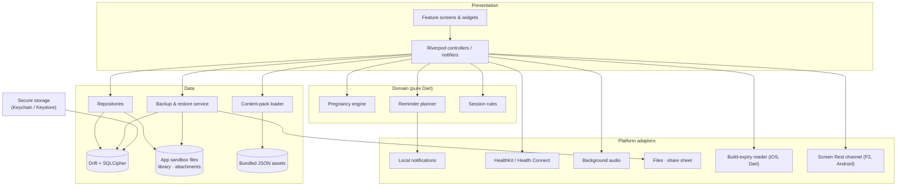
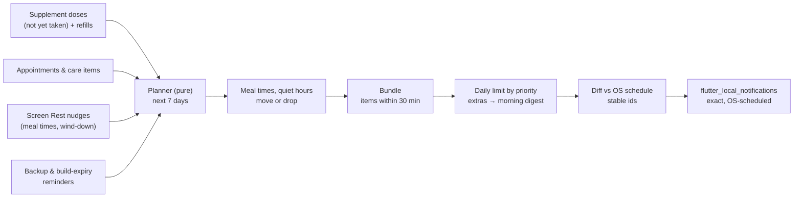
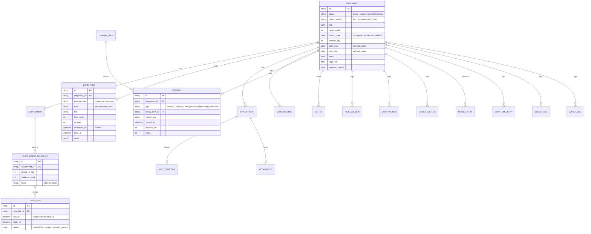

# Navmaas — Architecture Design

| | |
|---|---|
| **Status** | v18 — updated 2026-10-10 (MVP complete, M1–M6. Phase 2 split into M7–M11 and Phase 3 into M12–M14, each with scope and done-when criteria (§15); family sharing out of scope, ADR 042. M7 Wellbeing built (M7a schema v7, ADRs 044–045; M7b meditation, ADR 046). M10 home-screen widgets (M10a, ADRs 047–048) and app lock (M10b, ADR 049) built; M8 and M9 deferred by the owner. M11 built: limits for other apps (M11a, schema v8, ADR 050) and the Phase 2 release, Navmaas 1.1.0 (M11b). Updated 2026-10-08: enhancements E1–E4 planned (ADR 053); E1 Sessions fixes built (schema v9, ADRs 051–052); E2 links built (schema v10, ADR 054). Updated 2026-10-09: E3 voice letters built (schema v11, ADRs 055–056); E4 mood scenes built (ADR 057) and Navmaas 1.2.0. Updated 2026-10-10: release APKs signed with the owner's key, Navmaas 1.2.1 (ADR 060); M8a built: blood sugar, foods I avoid, hospital bag and birth plan (schema v12, ADRs 061–062), Navmaas 1.3.0; M8b built: meals from Nourishly (no schema change), Navmaas 1.4.0; M8 follow-ups, Navmaas 1.5.0) |
| **Stack** | Flutter (stable) · Dart 3 |
| **Inputs** | [Plan](PLAN.md) · [Design system](DESIGN_SYSTEM.md) · [Prototype](https://claude.ai/artifact/SQRrhaQU7odSc5FLNeKcJ8) |

## 1. Context and constraints

| Constraint | Consequence for the design |
|---|---|
| Personal use, free | No accounts, payments, analytics or backend |
| Tracking aid, no medical reviewer | Domain logic records and reminds; it never interprets readings |
| No SOS / emergency features | Emergencies are handled manually, as the doctor advises. The app has no emergency calls, location sharing or danger-sign content |
| Owner supplies Garbhasanskar content | In-app import of PDF, text and audio, stored on the device |
| Public MIT repository | Only original or public-domain content in `assets/`; no secrets in the repo |
| India, English only | `en` strings through `gen-l10n` (ready for more later); India care template |
| iPhone signed with a **free Apple ID** | Only capabilities available to a personal team; the build expires every 7 days, so the app warns before expiry (§12) |
| No cloud | Password-protected backup file is the only way data survives a lost or wiped phone (§11) |
| Calm, low-screen product | Audio-first sessions, a notification budget, quiet hours, Screen Rest |
| Low-end Android phones | Small app size, no background polling in the MVP, offline-first |

**Non-functional targets**

- Cold start under 2 s on a 3 GB-RAM Android phone.
- Phone APK at most 100 MB, universal APK at most 150 MB (the owner's limits; CI fails the phone APK over 100 MB). Since M4a the phone build is Arm only (`--target-platform android-arm,android-arm64`, about 66 MB at M6); the universal APK, which adds x86_64 for emulators, is about 103 MB, so it is for emulators only, and `--split-per-abi` gives about 30 MB per phone. PDFium (the PDF engine) is about 5 MB per ABI.
- 100 % offline.
- No network calls.
- Every screen usable at 200 % text size and with TalkBack / VoiceOver.
- A backup streams through in a fixed amount of memory, whatever the library size: a 500 MB library needs about what a 50 MB one does (about +30 MB on a Mac, up to ~80 MB on CI's Linux, depending on garbage collection; owner decision 2026-10-06).

## 2. Architecture at a glance



- **One Flutter app, no server.** All state lives in an encrypted SQLite database plus files in the app sandbox.
- **Domain is pure Dart.** The pregnancy engine and the reminder planner have no Flutter imports, so they are fast to unit-test.
- **Platform adapters sit behind interfaces**, so tests can use fakes.

## 3. Tech stack

| Concern | Choice | Notes |
|---|---|---|
| Framework | Flutter stable, Dart 3 | Material 3 with custom tokens |
| State & DI | `flutter_riverpod` (+ `riverpod_generator`) | Compile-safe providers, easy overrides in tests |
| Navigation | `go_router` | `StatefulShellRoute` for the 5 tabs, keeping each tab's stack |
| Database | `drift` + `sqlite3` (SQLCipher build) | Typed SQL, migrations, reactive streams, encrypted at rest. `sqlcipher_flutter_libs` is end-of-life, so `pubspec.yaml` selects SQLCipher with `hooks: user_defines: sqlite3: source: sqlcipher`. The binary is fetched and checksum-verified at build time only |
| Files | `path_provider` | App support folder that holds the database |
| Secrets | `flutter_secure_storage` | Holds the random 256-bit DB and attachment keys |
| Models | Plain Dart classes, hand-written `fromJson` | One small content-pack model; a test loads the real `weeks.json`, so code generators (`freezed`, `json_serializable`) aren't needed |
| Icons | `path_parsing` (flutter.dev) | Turns the prototype's SVG path data into Flutter paths, so its own line icons are drawn exactly |
| Notifications | `flutter_local_notifications` + `timezone` + `flutter_timezone` | Local reminders scheduled with the OS (exact alarms on Android), no push. `timezone` lists `http` for its own data-download script; the app never calls it (ADR 020) |
| Health | `health` | M4b. Reads steps from HealthKit and Health Connect; never writes (ADR 030) |
| Recording | `record` | E3. Records a voice letter as AAC (mono, 64 kbps) into the private temporary folder; Dart seals it at once (ADR 055). No network code; `RECORD_AUDIO` / `NSMicrophoneUsageDescription` |
| Audio | `just_audio` + `audio_service` | Background playback, lock-screen controls, sleep timer (M4a). M7b: the meditation timer is a playlist of two bundled assets (`assets/audio/bell.wav`, `quiet.wav`, generated by `tool/bell.dart`), so no new package. `audio_service` brings a download cache (`flutter_cache_manager` → `http`, `sqflite`) that Navmaas never calls (ADR 026) |
| Reading | `pdfrx` for PDF; built-in renderer for text/Markdown | M4a. PDFium is fetched at build time only. EPUB later (Plan decision 24) |
| Import / export | `file_picker` (open), `image_picker`, `share_plus` | Books and audio (`file_picker`, M4a); backup files are opened with `file_picker` and saved through the share sheet (`share_plus`, M5b), because `file_picker`'s save dialog needs the whole file in memory; `image_picker` (M3b) takes or chooses prescription photos through the system camera and photo picker, so no camera permission is declared |
| Backup | `cryptography` (Argon2id, ChaCha20-Poly1305) | See §11. The body is a simple stream of files, so `archive` isn't needed (Plan decision 33). `cryptography` also encrypts attachments with AES-256-GCM (M3b, §13) |
| Device | `url_launcher` | "Call clinic" opens the dialler; "Directions" opens Apple Maps or Google Maps on iPhone and the maps app on Android (ADR 024); E2: a saved link opens in YouTube, YouTube Music or Spotify (`LaunchMode.externalNonBrowserApplication` first), or the browser (`externalApplication`) when no app takes it (ADR 054) |
| Widgets | `home_widget` | M10a. Saves the widget snapshot to the App Group (iOS) or shared preferences (Android), reloads the widgets and schedules the Android widget's redraws (ADR 047) |
| Security | `local_auth` (optional app lock) | M10b. Face ID, Touch ID or fingerprint, not biometric-only, so a failure falls back to the phone's passcode (ADR 049) |
| Utilities | `intl`, `uuid` (v7), `collection` | |
| Lints & tests | `very_good_analysis`, `flutter_test`, `mocktail` (when a fake needs it), `integration_test` | Golden tests for light/dark |
| Native | Swift platform channel `navmaas/files` (M1, keeps the database out of iOS backups); the home-screen widget (M10a: a Swift WidgetKit extension and a Kotlin app widget, both fed by `home_widget`); the Kotlin `navmaas/usage` channel and WorkManager check for app limits (M11a, ADR 050; `androidx.work`, already in the app through `home_widget`, is declared directly); the `navmaas/screen` channel in Swift and Kotlin that keeps the screen on while she records a voice letter (E3, ADR 056) | The build expiry (M5a) is read in Dart from the app bundle, so it needs no channel (ADR 033) |
| Planned (Phases 2–3) | `pdf` (M9 visit summary), an unzip + XHTML parser such as `archive` + `html` (M9 EPUB) | Candidates only. Each is added only after the owner approves it at its milestone's start, then recorded here and in an ADR (§15). All must work offline |

Versions are pinned in `pubspec.lock`. M1 started on Flutter 3.47.3 / Dart 3.13.3 with the latest stable packages; upgrades are deliberate.

## 4. Project structure

Feature-first. Screens and widgets live in `lib/features/<feature>/`. A feature adds `data/` (repositories, table access), `domain/` (models, pure logic) and `presentation/` (screens, widgets, controllers) subfolders once it has more than screens. Tables used by several features (`pregnancy`, `settings`) live with their repositories in `core/db/`.

```
pregnancy-care/
├─ lib/
│  ├─ main.dart
│  ├─ app/                 # NavmaasApp, router, tab bar, theme mode, reminder sync + actions, widget sync (M10a), app-limit sync (M11a)
│  ├─ core/
│  │  ├─ theme/            # AppTheme (tokens → ThemeData light/dark), NavmaasColors, brand mark, prototype icons
│  │  ├─ db/               # drift database, tables, key handling, attachment store, shared repositories, delete all data
│  │  ├─ pregnancy/        # pregnancy engine (pure Dart)
│  │  ├─ reminders/        # planner (pure), scheduler adapter, calm-notification settings, data reminders (build expiry)
│  │  ├─ content/          # content-pack loaders (weeks, India care template, daily activities)
│  │  ├─ widgets/          # shared widgets: pill segmented control, step button, icon motion, amber notice
│  │  ├─ platform/         # audio playback (M4a), steps (M4b), iPhone build expiry (M5a), widget publisher (M10a), authenticator (M10b), app usage (M11a), voice recorder, player and screen-on (E3), Nourishly's share file (M8b)
│  │  └─ utils/            # clockNow, todayProvider / nowProvider (clock), date-only maths and formatting
│  ├─ features/
│  │  ├─ onboarding/
│  │  ├─ today/            # today screen, today's plan card, "How are you today?" card (M7a), Screen Rest card, mood scene card and painter (E4), Hospital bag card (from week 32, M8)
│  │  ├─ journey/          # journey screen; data/ checklist repository
│  │  ├─ sessions/         # data/ domain/ presentation/: library, reader, listen, letters, path (M4a); walk, exercise, breathing (M4b); meditation and the shared screen-off overlay (M7b); the unfinished walk (domain/walk_draft.dart, E1); saved links (data/media_link_repository.dart, domain/media_link.dart, E2)
│  │  ├─ care/             # data/ domain/ presentation/: supplements (M3a); vaccines & tests, visits, vitals (M3b)
│  │  ├─ nutrition/        # data/ foods she avoids, nourishlyShareProvider; domain/ the share-file parser (pure); presentation/ Care → Nutrition: From Nourishly (M8b), Foods I avoid (M8a)
│  │  ├─ birth_prep/       # data/ the hospital bag (mergeBag: template keys plus her own items) and birth-plan answers; domain/ the bag reminder; presentation/ Hospital bag, Birth plan (M8a)
│  │  ├─ third_trimester/  # data/ domain/ presentation/: kick counter, contraction timer, her patterns (M5a)
│  │  ├─ backup/           # data/: the .navmaas file format, the backup service, the backup log; presentation/: Backup & restore
│  │  ├─ screen_rest/      # data/ time in Navmaas, eye-rest setting, app limits (M11a); domain/ rest windows and nudges, the app-limit rules (pure); presentation/ Screen Rest (M6a), Limits for other apps (M11a)
│  │  ├─ wellbeing/        # data/ mood, symptom, sleep and water logs; domain/ the week, water nudges, chip folding (pure); presentation/ Wellbeing, mood, symptoms, sleep, water (M7a)
│  │  ├─ app_lock/         # the lock state (lifecycle and timeout), the lock screen and the app-switcher cover (M10b)
│  │  ├─ home_widget/      # domain/ the home-screen widget snapshot (pure) (M10a)
│  │  └─ settings/         # me (with this iPhone build), edit details, your doctor, pause or end tracking and the quiet "tracking stopped" page, the delete-all-data dialog
│  └─ l10n/app_en.arb      # every string; gen/ is generated by `flutter pub get`
├─ assets/
│  ├─ content/             # weeks.json (M2), care_template_in.json (M3b), activities.json (M4a), routines.json (M4b)
│  ├─ audio/               # bell.wav and quiet.wav for meditation (M7b), generated by tool/bell.dart
│  └─ fonts/               # Nunito, Literata (OFL)
├─ test/                   # unit, widget, accessibility; drift/ migrations; goldens/
├─ integration_test/      # on-device checks (reminders scheduled by the OS, the iPhone build expiry)
├─ drift_schemas/          # schema snapshots per schemaVersion
├─ android/  ios/          # ios/NavmaasWidget/: the WidgetKit extension; android NavmaasWidget.kt + res/layout/navmaas_widget.xml (M10a); android AppUsage.kt + AppLimitCheck.kt (M11a)
├─ design/                 # navmaas-tokens.css (prototype tokens)
├─ docs/                  # content/*.md are the generated review copies of the content packs
├─ tool/                  # content_md.dart regenerates the content review copies; bell.dart generates Meditation's bell and quiet clip
├─ .github/workflows/ci.yml
├─ build.yaml              # drift + riverpod codegen order
└─ CLAUDE.md               # commands and conventions for Claude
```

## 5. Layers and state

- **Repositories** expose `Stream`s from Drift queries (`watch…`) and `Future` commands. Screens never touch the database directly.
- **Controllers** (`Notifier` / `AsyncNotifier`) combine repositories with domain logic for each screen. For example, `todayPlanProvider` merges supplement schedules, the session plan and the next appointment.
- **One wall clock** (`core/utils/clock.dart`). `clockNow()` is the only place the app reads the time: row stamps, session starts, "today". Widget tests pin it to 9:00 on their fixed day (`pumpApp`), and fake time moves it on, so what the app writes falls on the day the screens show (ADR 031).
- **`todayProvider`** gives today's calendar date, so date-dependent logic (gestational age, reminders, build expiry) can be tested with a fixed date. `nowProvider` gives the time for time-of-day wording (the greeting). Both read `clockNow`, and the app refreshes them when it returns to the foreground.
- **Startup:** `main()` opens the database and waits for the first pregnancy values (active and latest) and theme values and the content pack before the first frame. It *listens* to those providers: Riverpod 3 pauses streams nobody listens to, and a plain `read` would wait forever.
- **Side effects** (scheduling notifications, Health reads, audio, file export) go through adapter interfaces, overridden with fakes in tests.

## 6. Pregnancy engine

This is pure date-only maths on calendar dates in the device's time zone, with no `DateTime` time-of-day arithmetic, so it is safe across DST.

| Dating method | Pregnancy start (gestational day 0) |
|---|---|
| Last period (LMP) | `lmp + (cycleLength − 28)` days |
| Conception | `conception − 14` days |
| IVF, day-5 embryo | `transfer − 19` days |
| IVF, day-3 embryo | `transfer − 17` days |
| Due date from scan | `scanEdd − 280` days |

- **Due date** = start + 280 days.
- **Gestational age** = today − start → `weeks = ga ~/ 7`, `days = ga % 7` (shown as "24 weeks 4 days").
- **Trimester:** 1 for < 14 w, 2 for < 28 w, 3 otherwise (boundaries 13w6d / 27w6d).
- **Month (display):** `ga ~/ 30.44 + 1`, capped at 10, so 24w4d shows as "Month 6".
- **Edge cases:**
  - Gestational age below 0, or above 44 weeks (more than 308 days, so from 44w1d), prompts the user to review the dates.
  - Past the due date, the app shows "due date + N days".
  - A twins flag changes copy only.
  - A paused, ended or delivered pregnancy isn't shown at all: the router replaces the tabs with one quiet page (Plan decision 31).
- **Storage:** dates are UTC-midnight `DateTime`s in code and `yyyy-MM-dd` text in the database.
- **Tests:** table-driven unit tests for every method, cycle lengths 21–40, leap years, month and year ends, trimester boundaries, below 0 / above 44 weeks, and DST. Expected dates are computed independently (Python `datetime`), not with the formulas under test.

## 7. Reminder scheduler

Every notification goes through one place, so the calm rules always apply.



The planner (`core/reminders/planner.dart`) is pure Dart and table-tested; `ReminderSync` (`app/reminders.dart`) feeds it and hands the result to the scheduler adapter. Its state is the plan, so the home-screen widget can show the next notification (M10a, Plan decision 49).

Sources (M3): untaken supplement doses and refills; visits the evening before (7 pm, mentioning questions waiting) and 2 hours before; booked tests, scans and vaccines the evening before; an unbooked one when its week window opens (10:00). M5a: the iPhone build expiry, the day before at 10:00. M6a: Screen Rest's nudges, a gentle notice as each meal window starts ("Meal time · Phone down — enjoy your meal.") and the wind-down nudge (off by default, 9:00 pm). M7a: water nudges ("Water · A glass of water, whenever you're ready."), off by default, every 2 or 3 hours from the end of quiet hours to their start (7:00 am – 9:30 pm when bedtime rest is off); today's stop once her water goal is reached (Plan decision 41).

Pregnancy reminders (supplements, visits, care items), Screen Rest's nudges and water nudges come only from the *active* pregnancy, so pausing or ending tracking stops them at once. Data reminders (build expiry; the weekly backup in M5b) keep running, because they protect her data.

1. **Rest windows** (Screen Rest, M6a; times also in Me):
   - **Quiet hours** ("Bedtime rest", default on, 9:30 pm – 7:00 am): reminders inside them move to their end; nudges are dropped. Switched off, there are no quiet hours.
   - **Meal times** (default on, 1:00–1:45 pm and 8:00–8:45 pm; each window 45 minutes from its start): reminders inside one wait until it ends (and then for quiet hours, if it ends inside them); other nudges there are dropped; the window's own notice is not held.
2. **Bundling:** reminders within 30 minutes of each other become one notification at the first time ("Supplements: Folic acid · Calcium"). Bundling happens before the limit, so a bundle counts once.
3. **Daily limit** (default 4, 1–8 in Me), by priority:
   1. Appointments.
   2. Build expiry and backup.
   3. Supplements.
   4. Care items.
   5. Nudges (Screen Rest's meal-time notices and wind-down; water).

   Over the limit, the rest fold into one morning digest at the end of quiet hours. If that morning has already passed, today's digest is skipped (the items are still on Today and in Care). Nudges never wait for the digest: a nudge over the limit is dropped, and when only nudges are over it there is no digest. The digest names three items, then "and N more".
4. **Rolling window:** only the next 7 days, at most 60 pending (iOS allows 64).
5. **Stable ids** (FNV-1a of the keys and time) let the sync cancel or replace exactly what changed; a changed title or body is rescheduled too. Snoozed reminders are left alone.
6. **On time, even when locked** (owner requirement, ADR 019): notifications are scheduled with the OS. iOS fires them on time whether the app is open or the phone is locked. Android uses exact alarms (`exactAllowWhileIdle`, `USE_EXACT_ALARM`; `SCHEDULE_EXACT_ALARM` on Android 12), falling back to inexact only if exact alarms are switched off. The plugin's boot receiver reschedules after a reboot.
7. **Re-planning:** on start, on resume (which also re-reads the time zone and picks up doses logged from a notification), and whenever the calm-notification settings, supplements or taken doses change, or today's water goal is reached (not on every glass).
8. **Permission:** asked in onboarding (optional step), from Me → Reminders, and once after the first supplement is saved. Reminders stay off until it's granted.
9. **Taps** (M6a): tapping the digest opens Today; tapping wind-down opens Listen on the audio she played last, already in screen-off mode (Sessions if she has no audio). Others open the app where she left it. A tap that launches the app is handled after the first frame.
10. **Actions:** dose notifications have "Taken" (logs every dose in the notification, one off the stock) and "Snooze 30 min". They work from a background isolate that opens the encrypted database itself. Refills: a 10:00 reminder while stock is at or below the refill level.

## 8. Data model

All tables use `id` (UUID v7, text), `created_at`, `updated_at` and a nullable `deleted_at` (soft delete); timestamps are stored as ISO-8601 text. This keeps the schema ready for an optional sync later. M1 created `pregnancy` and `settings`, M2 `checklist_tick`, M3a `profile`, `supplement`, `supplement_schedule` and `dose_log`, M3b `care_item`, `appointment`, `visit_question`, `attachment` and `vital_reading`, M4a `library_item`, `session` and `letter`, M5a `kick_session`, `contraction` and `backup_log`, M7a `mood_entry`, `symptom_entry`, `sleep_log` and `water_log`, M11a `app_limit`, M8a `avoid_food`, `bag_item` and `birth_plan_answer` (with `vital_reading.context` and `note`); E1 added `library_item.furthest`, E2 `media_link`; the other tables arrive with their milestones.



Tables not shown in detail:

| Table | Purpose |
|---|---|
| `profile` | M3a. One row: doctor name, clinic, clinic phone and clinic address (all optional; used for Call clinic and Directions on visits). The owner's first name is the `first_name` setting |
| `supplement` | M3a. Name, dose text exactly as prescribed (never suggested), notes, stock (doses left) and refill level. Unmarked doses aren't stored; the weekday mask lives on each schedule |
| `appointment` | M3b. Time, doctor, place (default from `profile`), notes, bring-along items (one per line) |
| `visit_question` | M3b. Waits unlinked for the next visit; ticking it as asked links it to that visit |
| `attachment` | M3b. Encrypted file name (in `db/attachments/`), MIME type, the visit it belongs to |
| `vital_reading` | M3b. `weight` (kg) or `bloodPressure` (systolic / diastolic, mmHg) and time; M8a adds `bloodSugar` (whole mg/dL) with `context` (fasting, before a meal, 1 h or 2 h after, bedtime) and a `note`. Logged only, never interpreted |
| `library_item` | M4a. Kind (`pdf` / `text` / `audio`), title, file name inside `db/library/`, audio length, and where she left off: `position` (PDF page, 0-based, or thousandths of the way through a text) out of `total`, plus `last_opened_at`. E1 (v9): `furthest`, how far she has read in the same units, which only goes up; the library's progress and "Finished" use it, while the reader reopens at `position` (Plan decision 56). Not tied to a pregnancy. Reading progress lives here, so there is no separate `reading_progress` table |
| `session` | M4a. A reading session is logged when she leaves the reader after at least a minute (E1: or by ticking Today's reading row, 15 minutes with no `library_item_id`, soft-deleted when unticked; Plan decision 57); listening is one session per item played, growing while it actually plays (from one minute). M4b: a walk (with the steps Health counted during it), a routine (`routine_key`) or breathing, each logged from one minute. A walk keeps counting with the screen off; the others pause in the background. E1: walks, routines and breathing start at Start; a walk is logged only at Finish walk, with the time and steps of the stretches she walked (the unfinished walk waits in the `walk_draft` setting; Plan decision 58). M7b: `meditation`, logged like listening (playing time, from one minute) from the timer's track or her own audio (then with its `library_item_id`); Finish or the end bell closes it, so the next one is a new session |
| `letter` | M4a. Letters to baby (body text), in the encrypted database. E3 (v11): `voice_file` (its sealed voice note in `db/voice/`) and `voice_sec`; `body` is empty for a voice-only letter (Plan decision 62) |
| `kick_session` | M5a. Movements counted (`count`) from the first tap (`started_at`) to the last (`ended_at`). Saved with Save, or when she leaves with a count |
| `contraction` | M5a. Start and end of each timed contraction, saved when it ends (or when she leaves mid-way) |
| `checklist_tick` | M2. Ticked items from the weekly checklists: `pregnancy_id`, `item_key` (the content pack's stable key, e.g. `w24-gtt`), unique together. Unticking soft-deletes the row |
| `mood_entry` | M7a. One check-in a day (`day`, unique with the pregnancy): `mood` is a key (`calm` / `happy` / `okay` / `tired` / `low`), plus an optional `note`. Only today's can change |
| `symptom_entry` | M7a. `logged_at`, `symptom_key` (a pick-list key such as `backache` or `swollenFeet`) or her own `custom_name`, `severity` (`mild` / `moderate` / `strong`) and a `note`. Removing one soft-deletes it |
| `sleep_log` | M7a. One night per wake-up `day` (unique with the pregnancy): `bed_at`, `woke_at`, `nap_minutes` and `rested` (`rested` / `bitTired` / `veryTired`, optional) |
| `water_log` | M7a. Glasses on a `day` (unique with the pregnancy); + / − change the count, never below zero |
| `media_link` | E2 (v10). A link she saved: `title`, `url` (YouTube, YouTube Music or Spotify, always `https`) and `last_opened_at`. Which service it is comes from the address when shown, so nothing else is stored. Not tied to a pregnancy; removing one soft-deletes it. In every backup, like the rest of the database (Plan decision 61) |
| `avoid_food` | M8a (v12). A food she avoids: `name` and her own `reason` (optional). Per pregnancy; removing one soft-deletes it. The app adds no food guidance |
| `bag_item` | M8a (v12). Her hospital bag: a template item she ticked (`template_key`, unique per pregnancy) or one of her own (`label`), its `section` (for me, for baby, documents) and `packed`. Labels of template items come from `hospital_bag.json`, so rewording one keeps her tick (ADR 062) |
| `birth_plan_answer` | M8a (v12). Her answer to a birth-plan prompt (`prompt_key`, unique per pregnancy), in her own words; a blank answer soft-deletes it |
| `app_limit` | M11a (Android). A daily limit on another app: `package` (unique), `label` (its name when she chose it), `minutes` (15–120). Not tied to a pregnancy; removing one soft-deletes it, and choosing the app again brings the row back. Backed up like everything else; on another phone only installed apps show their icon |
| `backup_log` | M5a (written from M5b). `kind` (`backup` / `restore`), `size_bytes`, `includes_library`; the row's `created_at` is when. Never the password |
| `settings` | Key-value. M1: `theme_mode` (`light` / `dark` / `system`, default system), `first_name`. M3a: `reminders_on`, `daily_limit` (1–8, default 4), `quiet_start` / `quiet_end` (minutes after midnight, default 1290 / 420), `reminders_offered`. M4a: `night_reading` (default on). M4b: `step_goal` (default 6,000). E1: `walk_draft` (the walk she started and hasn't finished: the start and end of each stretch as JSON; removed at Finish walk; ADR 051). M5b: `backup_day` (weekly backup reminder, 1–7 for Monday–Sunday or 0 for off; default 7, Sunday). E3: `backup_voice` ("Include voice letters", default off). M6a (Screen Rest, ADR 037): `quiet_on` (bedtime rest, default on), `meal_rest` (default on), `meal_lunch` / `meal_dinner` (window starts, default 780 / 1200), `eye_rest` (default on), `wind_down` (default off), `wind_down_at` (default 1260), and `use_day` / `use_seconds` (time in Navmaas on that day, saved when the app leaves the screen). M7a: `water_goal` (glasses, 4–16, default 8), `water_remind` (default off), `water_every` (2 or 3 hours, default 2) and `wellbeing_card_hidden` (the day Today's "How are you today?" card was closed). M10a: `widget_hide` ("Hide details on widget"; unset, it follows app lock: off, or on while app lock is on; Plan decision 47). M10b: `app_lock` (default off) and `app_lock_after` (1, 5 or 15 minutes, default 1; Plan decision 48) |

Migrations are versioned with Drift's `schemaVersion` (1 in M1, 2 in M2: adds `checklist_tick`, 3 in M3a: adds `profile`, `supplement`, `supplement_schedule`, `dose_log`, 4 in M3b: adds `care_item`, `appointment`, `visit_question`, `attachment`, `vital_reading`, 5 in M4a: adds `library_item`, `session`, `letter`, 6 in M5a: adds `kick_session`, `contraction`, `backup_log`, 7 in M7a: adds `mood_entry`, `symptom_entry`, `sleep_log`, `water_log`, 8 in M11a: adds `app_limit`, 9 in E1: adds `library_item.furthest`, filled from `position`, 10 in E2: adds `media_link`, 11 in E3: adds `letter.voice_file` and `voice_sec`, 12 in M8a: adds `vital_reading.context` and `note`, `avoid_food`, `bag_item`, `birth_plan_answer`). Upgrades use drift's step-by-step helper (`app_database.steps.dart`, generated). Schema snapshots live in `drift_schemas/`. `test/drift/navmaas/migration_test.dart` checks that the tables match the latest snapshot and that every older version migrates to every newer one. After a schema change: bump `schemaVersion`, write the migration, run `dart run drift_dev make-migrations`.

## 9. Content

| Source | Where | Rules |
|---|---|---|
| Week-by-week notes, checklists, India care template, daily activities, exercise routines | `assets/content/*.json`, versioned with `schemaVersion` | **Only original or public-domain text.** General information, no doses, no outcome claims |
| Garbhasanskar books (PDF / text) and audio | Imported in-app with `file_picker`, streamed into `<app support>/db/library/` (the folder OS backups skip); the DB stores the file name | Never leaves the phone except inside a backup the owner makes. Never committed to the repo |

- `weeks.json` (`schemaVersion` 1) has one entry per week, 4–42: `week`, `size` (an Indian fruit or vegetable, read after "About the size of"), `baby`, `you`, and `checklist` items as `{key, text}`. The key stays stable when wording changes, so ticks survive edits. The trimester is worked out from the week number, not stored.
- The text is original, written to the standard of an experienced obstetrician and approved by the owner. `docs/content/weeks.md` is its review copy, generated by `dart run tool/content_md.dart`; a test fails if the two differ.
- `care_template_in.json` (M3b, `schemaVersion` 1) lists the tests, scans and vaccines commonly offered in India: `key`, `kind` (`test` / `scan` / `vaccine`), `title`, `fromWeek`, `toWeek`, `note`. Each pregnancy gets one `care_item` per entry, created once (new entries are added on update). Every note defers to her doctor; review copy: `docs/content/care_template.md`.
- `activities.json` (M4a, `schemaVersion` 1): about 30 calm activities (`key`, `title`, `text`), original, no claims about what they do for the baby. The path's Activity tile shows one a day, by day of pregnancy, cycling. Review copy: `docs/content/activities.md`.
- A test enforces the hard lines on the content: no dose or unit words, no sex prediction, no outcome claims, no emergency or danger-sign wording.
- Wellbeing's words (M7a, Plan decision 43): the database stores keys (mood, symptom, severity, rested); their words live in `app_en.arb` under `moodWord*`, `symptomPick*`, `severity*` and `restedWord*`, like the supplement quick-pick names. The content test checks that every key has a word (and every word a key), and that no Wellbeing string has advice, warning, verdict or good/bad wording.
- `routines.json` (M4b, `schemaVersion` 1): `key`, `title`, `trimesters`, `avoidIfHighRisk` and timed `moves` (`name`, `how`, `sec`). Sessions shows the routines for the current trimester, hides the cautious ones when "High-risk pregnancy" is on, and keeps them locked until "Doctor cleared me for exercise" is on (Me; stored on `pregnancy`). Walking is always open (Plan decision 27). Every routine and walk shows the same general line instead of a "stop if" list (Plan decision 26), so routines carry no note of their own. No move lies flat on the back (a test checks). Review copy: `docs/content/routines.md`.

## 10. Platform integrations

| Capability | MVP behaviour | Platform notes |
|---|---|---|
| Steps & walks (M4b) | Reads today's steps and the steps during a walk (only the stretches she walked, E1; asked on the first walk, re-read every 30 s); records walk sessions in Navmaas. Never writes to Health | iOS: HealthKit entitlement (`Runner.entitlements`, available to a free Apple ID) and a read-only usage string. Android: `health.READ_STEPS`, Health Connect queries, the permissions-rationale intent filter and the Android 14 `VIEW_PERMISSION_USAGE` alias; min SDK 26. On Android 9–13 the Health Connect app comes from the Play Store; Android 8 has none, so steps show "—" |
| Background audio (M4a) | Plays with the screen off and shows lock-screen controls (back / forward 15 s, play / pause); sleep timer of 10, 20 or 30 min. The audio service starts on first play, not at app start. M7b: the meditation timer plays as one track (bell, 30 s quiet clips with the last one clipped, bell at exactly 5–20 min), so it keeps time and rings with the phone locked; its position and length cover the whole track | iOS `UIBackgroundModes` → `audio` (available to a free Apple ID); Android `AudioService` media foreground service (`FOREGROUND_SERVICE_MEDIA_PLAYBACK`, `WAKE_LOCK`) and `MainActivity` extends `AudioServiceFragmentActivity` |
| "Screen off — keep listening" | Switches to a near-black overlay that wakes on tap, and lets the phone lock normally | No wakelock is held |
| Calls and maps (M3b) | "Call clinic" opens the dialler; "Directions" opens Apple Maps or Google Maps (if installed) on iPhone, or the default maps app on Android, with the clinic address | Android declares `tel` and `geo` intent queries; iOS lists `comgooglemaps` to check Google Maps is installed. The maps app does any network use; Navmaas doesn't |
| Prescription photos (M3b) | Take or choose a photo; it's encrypted before it touches disk | iOS camera and photo-library usage strings; Android uses the system photo picker and camera, so no permission |
| Backup files | Save through the share sheet ("Save to Files" on iPhone; Files, Drive or another app on Android); open with the system file picker | Other apps (e.g. Google Drive) do the uploading; Navmaas itself stays offline |
| Build expiry (iOS) | Reads the signing expiry date from the app bundle's provisioning profile; shows it in Me and on Today, and reminds before it | §12 |
| Home-screen widget (M10a) | Small and medium on iPhone, one resizable widget on Android: the week and day, the baby-size line and the next notification (Plan decision 49). Hidden details: the brand mark and the next reminder's time; tracking stopped: the mark only. A tap opens Today. The widget never opens the database: `WidgetSync` (`app/home_widget.dart`) writes a JSON snapshot whenever the plan, the pregnancy or "Hide details" changes, with 28 days of week text and up to 20 reminders, every word from `app_en.arb` (ADR 047) | iOS: WidgetKit extension `com.patelkeyur.navmaas.widget` in the App Group `group.com.patelkeyur.navmaas` (free Apple ID, §12), timeline entries after each reminder in the next two days and at each midnight for a week. Android: `NavmaasWidget` (an `AppWidgetProvider` on `home_widget`'s), redrawn by `home_widget`'s scheduled updates at each reminder and midnight (re-armed after a reboot; `USE_EXACT_ALARM` was already held), no periodic update. Taps open `navmaas://widget/today`, which Flutter's deep linking hands to the router as `/today` (ADR 048). Both use the phone's system font |
| App lock (M10b) | Off by default; Me → Your data turns it on only when the phone has a screen lock. A fresh open is locked, and so is a return after 1, 5 or 15 minutes away (`AppLifecycleListener`: hidden to shown). The lock screen asks the phone as soon as it shows and again from Unlock. It sits above the router in `MaterialApp.builder` with what is underneath kept `Offstage`, so a notification or widget tap navigates behind it and nothing shows or is read out until she unlocks. While she is away (inactive or hidden), a plain cover hides her data from the app switcher. Taken / Snooze run in the background isolate and don't need unlocking (ADR 049) | iOS: `NSFaceIDUsageDescription`. Android: `USE_BIOMETRIC` (and `USE_FINGERPRINT` for old phones) from `local_auth`; `MainActivity` was already a `FlutterFragmentActivity` (audio_service's), as `local_auth` needs |
| Screen Rest (M6a) | In-app only: rest windows that hold reminders (§7), time in Navmaas today (`AppLifecycleListener`: counted while on screen, saved when it leaves), a 20-second eye rest every 20 minutes of reading, the wind-down nudge | No special permissions |
| Links (E2) | A saved YouTube, YouTube Music or Spotify link opens in that app first (`externalNonBrowserApplication`: `FLAG_ACTIVITY_REQUIRE_NON_BROWSER` on Android 11+, universal links only on iPhone), and in the browser only when no app takes it; "Couldn't open this link" when nothing can. Android 10 and older have no non-browser flag, so the phone chooses there | No new permission and no `<queries>` entry: `launchUrl` starts the view intent directly. Navmaas makes no network call; the other app does |
| Voice letters (E3) | Record asks for the microphone the first time; when it's off, a calm line points to the phone's Settings. Up to 10 minutes; the screen stays on while recording; leaving Navmaas stops and keeps it. Playback is a plain `just_audio` player on the letter screen (no lock-screen controls, not logged as listening) | `record` (AAC); `RECORD_AUDIO` / `NSMicrophoneUsageDescription`; `navmaas/screen` (`isIdleTimerDisabled` on iOS, `FLAG_KEEP_SCREEN_ON` on Android, only while recording) |
| Limits for other apps (M11a) | **Android only.** She gives Usage access in Settings, picks apps from her launcher and sets 15–120 minutes a day for each; Screen Rest shows today's minutes. Once an app passes its limit she gets one notice that day ("Time for a pause"), as a nudge: only outside quiet hours and meal windows (it waits for a window to end, the same day), only while the day has room under the daily limit, only while tracking. Nothing is blocked. Tapping it opens Screen Rest. Without Usage access the limits are paused, not lost | The `navmaas/usage` channel (`AppUsage.kt`): Usage access (`AppOpsManager`), launcher apps with 96 px icons (a launcher `<queries>` entry, no `QUERY_ALL_PACKAGES`), today's minutes from `UsageStatsManager` events. `AppLimitCheck.kt`: a WorkManager job every 15 minutes, enqueued only while a limit is set, follows the rules Dart writes (`limitRules`, ADR 050) and posts on the Reminders channel. Permission `PACKAGE_USAGE_STATS`, granted by her in Settings. Not possible on iPhone with a free Apple ID: Family Controls needs a paid membership |

## 11. Backup and restore

The backup is a single password-protected file (`navmaas-backup-YYYY-MM-DD.navmaas`) that the owner saves wherever she likes. It is the only way data survives a lost phone, a deleted app or a move to a new phone.

```mermaid
flowchart TB
  subgraph Create["Create backup"]
    C1["Password ×2<br/>(min 8 chars, never stored)"] --> C2["VACUUM INTO<br/>(consistent, still encrypted)"]
    C2 --> C3["Snapshot: DB copy,<br/>attachments,<br/>library (optional),<br/>voice letters (optional)"]
    C3 --> C4["manifest.json (last)<br/>DB key, attachment key, counts"]
    C4 --> C5["File stream<br/>(length-prefixed)"]
    C5 --> C6["Argon2id(password, salt)<br/>ChaCha20-Poly1305 in 1 MiB chunks"]
    C6 --> C7[".navmaas file<br/>Save to Files or share"]
  end
  subgraph Restore["Restore"]
    R1["Pick .navmaas file"] --> R2["Read header<br/>show date, size, app version"]
    R2 --> R3["Password → decrypt<br/>(tag failure = wrong password or damaged file)"]
    R3 --> R4["Unpack to a staging folder<br/>every piece authenticated"]
    R4 --> R5["PRAGMA rekey to<br/>this phone's DB key"]
    R5 --> R6["Move db/ aside (rollback),<br/>staging → db/, reopen<br/>(migrations run if older)"]
    R6 --> R7["Re-plan reminders<br/>delete staging + rollback"]
  end
```



### File format (version 1)

| Part | Content | Encrypted |
|---|---|---|
| Magic | `NAVMAAS` + format byte, 8 bytes | No |
| Header | JSON with format version, KDF parameters (`argon2id`, memory, iterations, parallelism, salt), cipher, chunk size, created date, app version, schema version, whether the library is included | No, but authenticated: its hash is part of every chunk's associated data |
| Body | The files one after another (each: 2-byte name length, name, 8-byte size, bytes; `manifest.json` last), split into 1 MiB chunks. Each chunk = 12-byte nonce + ChaCha20-Poly1305 ciphertext + 16-byte tag. Associated data = header hash + chunk index + "last chunk" flag, so chunks can't be reordered, dropped or truncated unnoticed | Yes |

### Rules

- **Password:**
  - At least 8 characters, typed twice, with a show/hide toggle.
  - Never stored, logged or included in `backup_log`.
  - There is no recovery: the screen says so before the backup is created.
- **Key derivation:** starts at Argon2id with 64 MiB memory, 3 iterations and 1 lane.
  - Measured in M5b (compiled Dart): 0.45 s on an M-series Mac, so a low-end phone should stay near the ~3 s target. Check on the phone; tune if it's slower.
  - Key derivation and encryption run in a background isolate, so the screen stays smooth.
  - The parameters live in the header, so they can change later without breaking old backups.
- **Consistent snapshot:** `VACUUM INTO` writes a consistent copy of the database, still SQLCipher-encrypted with its key (ADR 035). The DB key and the attachment key travel in the manifest, inside the password-encrypted body.
- **Integrity:** every 1 MiB piece is authenticated (ChaCha20-Poly1305 tag, header hash, index, last-piece flag), and each file's size is checked, so per-file hashes aren't needed. A failure on the first piece is reported as a wrong password, later ones as a damaged file. File names are checked so a crafted backup can't write outside its folder.
- **Streaming:** files are read and encrypted piece by piece into one reused buffer, so a 500 MB library never sits in memory (a test checks memory doesn't grow with its size).
- **Saving:** the finished file is handed to the share sheet ("Save to Files" on iPhone; Files, Drive or another app on Android). A picked backup is copied onto the phone first, so it can be read in pieces.
- **Library is optional:**
  - With the library off, a backup is small (a few MB) and quick to send.
  - With it on, the backup includes imported PDFs and audio.
  - When restoring a backup without the library, library entries stay listed. On the same phone the books and audio already there are kept; on a new phone, opening one asks her to choose the same file again ("Re-import file"), and her place in it stays.
- **Voice letters are optional (E3):** the "Include voice letters" switch on Backup & restore (off by default, remembered as `backup_voice`) adds `db/voice/`, still sealed with the attachment key that travels in the manifest. Without them, the letters' words come back and each voice note says it isn't on this phone; the voice notes already on the restoring phone go with the data they belonged to.
- **Restore is all-or-nothing:**
  - Any failure (wrong password, damaged piece, a newer format or schema than this app understands) leaves the current data untouched.
  - The backup is unpacked into its own staging folder and its database rekeyed to this phone's key; the backup's attachment key replaces this phone's (ADR 036).
  - The swap moves `db/` aside to `db-before-restore/`, moves the staging folder in and reopens the database. If it doesn't open, everything (and the attachment key) is put back. If the app stops mid-swap, the next start puts the old data back.
  - Restore can be started from onboarding (a new phone), from Me, or from the "tracking stopped" page.
- **Reminders:**
  - A weekly backup reminder at 10:00 on her chosen day (Sunday by default, or off), skipped when she backed up in the 6 days before it (Plan decision 32).
  - On iOS, the reminder the day before the build expires also says "back up" (§12); no separate weekly reminder that day.
  - Both keep running while tracking is paused or ended.
- **What is not in a backup:** scheduled notifications and caches, which are re-created after restore. The backup also contains no password hint.

## 12. iPhone with a free Apple ID

Apple's [capabilities table](https://developer.apple.com/help/account/reference/supported-capabilities-ios) sets what a personal team (free Apple ID) can sign.

| Capability | Free Apple ID | Navmaas use |
|---|---|---|
| HealthKit | ✓ | Reading steps |
| Background Modes | ✓ | Audio with the screen off |
| Data Protection | ✓ | File protection classes (below) |
| Keychain | ✓ | DB and attachment keys |
| App Groups | ✓ | Home-screen widget snapshot (M10a); Nourishly's meals (`group.com.patelkeyur.share`, M8b) |
| Family Controls | ✗ | Other-app Screen Rest is Android-only |
| Push notifications, iCloud | ✗ | Not needed: local reminders, file backups |

### The 7-day expiry

- **Behaviour:** a free-team build stops opening 7 days after it was signed. Running it again from Xcode (same Apple ID, same bundle ID) installs over the existing app and **keeps all data and Keychain items**.
- **Detecting it:**
  - Dart reads `embedded.mobileprovision` next to the app's executable (`Platform.resolvedExecutable`, inside `Runner.app`; ADR 033).
  - The profile is a signed envelope around a plain XML plist, so `parseProvisionExpiry` finds `ExpirationDate` as text.
  - On Android, the simulator, or when the file is absent, it's `null` and nothing is shown.
  - `integration_test/build_expiry_test.dart` checks it on the phone: within the next 7 days on an iPhone, `null` on the simulator.
- **Surfacing it:**
  - Me shows "This iPhone build · Expires Sat 10 Oct · in 6 days" (an amber card).
  - Today shows a quiet amber banner when 1 day is left.
  - The reminder planner schedules a notification the day before at 10:00 ("back up, then run it from Xcode again"). It keeps running while tracking is paused or ended.
  - If the build lapses, the app won't open (and reminders may stop) until it's run from Xcode again. Data stays on the phone.
- **Data-loss traps:**
  - **Deleting the app** deletes its data.
  - **Changing the Apple ID** changes the Team ID and Keychain group, so the stored DB key can't be read.
  - **Changing the bundle ID** installs a new, empty app.

  In all three cases, restore from the latest backup.

### Personal install steps

1. Enable Developer Mode on the iPhone (Settings → Privacy & Security). Trust the developer certificate after the first install (Settings → General → VPN & Device Management).
2. In Xcode, open `ios/Runner.xcworkspace` and choose the personal team. The bundle ID is `com.patelkeyur.navmaas`; keep it the same forever. Since M10a the widget extension (`NavmaasWidgetExtension`, `com.patelkeyur.navmaas.widget`) is a second target: choose the same personal team for it under Signing & Capabilities once; Xcode registers the App Group `group.com.patelkeyur.navmaas` for both, and every later run signs both. Since M8b Runner also joins `group.com.patelkeyur.share`, which Nourishly joins under the same team; Signing & Capabilities lists both groups.
3. Install a **release** build (`flutter run --release` with the phone connected, or Xcode with the Release scheme). Flutter debug builds on iOS only start from the debugger, not from the home screen.
4. Repeat step 3 within 7 days. The app reminds you the day before.

**File protection.** The DB and library use `completeUntilFirstUserAuthentication` (the iOS default, so nothing is set explicitly), so notification actions and background audio work while the phone is locked. Attachments use `complete`. The DB key uses Keychain accessibility `first_unlock_this_device`.

**OS backups.** iCloud and Finder backups stay on, but the database folder is marked `isExcludedFromBackup` (through the `navmaas/files` channel) and its key never leaves the device. Restoring an iPhone backup therefore doesn't bring Navmaas data back; the `.navmaas` file (§11) does. Android behaves the same way (below).

**Android.** Install a release APK signed with the owner's keystore, which is never committed and also signs Nourishly (ADR 060): release builds read `android/key.properties` (git-ignored) and fall back to the debug key when it's missing. Debug and profile builds use the owner's key too when that file is there (M8b): Navmaas and Nourishly both declare the `NOURISHLY_SHARE` signature permission, and Android refuses to install an app that declares it again under another key, so a debug-key Navmaas couldn't go on a phone with Nourishly (uninstalling Nourishly would delete her food log). CI writes that file from four repository secrets (`ANDROID_KEYSTORE_BASE64`, `ANDROID_STORE_PASSWORD`, `ANDROID_KEY_PASSWORD`, `ANDROID_KEY_ALIAS`), so GitHub releases carry the same key and install over each other. Auto Backup stays on (`allowBackup=true`), but `res/xml` backup rules exclude `files/db/` and the shared preferences that hold the key, because Android Keystore keys can't be restored on another phone. Keep the keystore safe: updates must be signed with the same key, or the old app has to be removed, which deletes its data. That case also needs a restore from backup.

## 13. Security and privacy

- **Network:** the app makes no network calls. Release Android builds omit the `INTERNET` permission (the main manifest removes it with `tools:node="remove"`, which also strips it from plugins), so the app itself cannot send data anywhere; debug and profile builds keep it for hot reload. Fonts are bundled.
- **Permissions (Android release):** `POST_NOTIFICATIONS`, `RECEIVE_BOOT_COMPLETED`, `USE_EXACT_ALARM`, `SCHEDULE_EXACT_ALARM` (Android 12 only) and `VIBRATE` (added by the notification plugin); `WAKE_LOCK`, `FOREGROUND_SERVICE` and `FOREGROUND_SERVICE_MEDIA_PLAYBACK` for background audio (M4a); `health.READ_STEPS` for walks (M4b); `USE_BIOMETRIC` and `USE_FINGERPRINT` for app lock (M10b); `PACKAGE_USAGE_STATS` for app limits (M11a; she turns it on in Settings, and only today's minutes for her chosen apps are read); `RECORD_AUDIO` for voice letters (E3; asked the first time she taps Record); `com.patelkeyur.permission.NOURISHLY_SHARE` to read Nourishly's meals (M8b; a `signature` permission Navmaas also declares, granted without asking). Never `INTERNET`; `ACCESS_NETWORK_STATE`, which a plugin asks for, is removed the same way.
- **Database:** encrypted with SQLCipher. A random 256-bit raw key is generated on first run and kept in Keychain / Android Keystore. The app refuses to open the database on a build without SQLCipher. The database and its key are excluded from OS backups on both platforms (§12).
- **Attachments** (prescription photos, reports) are encrypted with AES-256-GCM under a separate stored key (`navmaas.attachments_key.v1`), as nonce + ciphertext + tag, in `db/attachments/` inside the folder OS backups skip. Photos are only decrypted in memory to show them. Imported books and audio stay as plain files in `db/library/`, skipped by OS backups; they are the owner's own media, not health data, and audio must stream to the player.
- **Voice letters** (E3) are sealed with the attachment key in `db/voice/`. The recorder writes a plain file into the app's private temporary folder, sealed and deleted the moment she stops; playing decrypts a plain copy there for the player, deleted when the letter closes; the folder is also emptied when the app starts. A plain copy can't be avoided: `just_audio`'s in-memory source serves audio through a loopback HTTP server, which needs `INTERNET` on Android (ADR 055).
- **Backups:** encrypted with a key derived from the owner's password (§11). The password is never stored.
- **Nourishly link** (M8b, ADR 061): Navmaas only reads. On Android it declares and uses `com.patelkeyur.permission.NOURISHLY_SHARE` (`signature`, so only apps signed with the owner's key hold it) and lists Nourishly's provider in `<queries>`; on iPhone Runner joins App Group `group.com.patelkeyur.share` beside the widget's group. Not installed, sharing off or no permission all read as "not shared". Nothing from the file is stored or backed up.
- **Home-screen widget** (M10a): it reads a plain-text snapshot, never the database. With "Hide details on widget" it holds no week, size or reminder titles (a unit test checks this). On Android the snapshot sits in shared preferences, which OS backups already skip; on iPhone it's in the App Group's preferences, which iPhone backups include, so hiding details also keeps them out of those.
- **Optional app lock** (M10b) with Face ID, Touch ID or fingerprint, falling back to the device passcode (`local_auth`), off by default; see §10. It guards the screens, not the data: the database stays encrypted with its own key either way.
- **Deletion** (M6b): Me → Your data → "Delete all data" (red) opens a dialog that says what goes, shows when she last backed up with "Back up first", and a red "Delete everything". It cancels every reminder (snoozed ones too) and pauses audio, moves `db/` aside to `db-deleted/`, deletes both keys from Keychain / Keystore, opens a new, empty database under a new key (so the app starts again at onboarding), then deletes `db-deleted/`, any restore rollback, the backup work folders and the file picker's copies in the cache. If the app stops part-way, the next open deletes `db-deleted/`. It does not touch backup files saved elsewhere (ADR 040).
- **Repository hygiene:**
  - No keystores, provisioning profiles, `google-services` files or personal content in git.
  - `.gitignore` covers `*.jks`, `key.properties`, `*.mobileprovision`, `*.navmaas` and `/library`.

## 14. Theming and accessibility

- Tokens from [DESIGN_SYSTEM.md](DESIGN_SYSTEM.md) become `ThemeData.light/dark`: a `ColorScheme` plus the `NavmaasColors` extension. `ThemeMode` is user-selected (Light / Dark / System).
- The reader has its own Paper / Night palette. It opens in Night from 9 pm to 5 am when "Night reading after 9 pm" is on (the default), or whenever the app is dark.
- **Accessibility:**
  - `MaterialTapTargetSize.padded` and minimum 48 dp targets.
  - `Semantics` labels on icon-only buttons; password fields announce show/hide state.
  - Text follows `MediaQuery.textScaler` and is tested at 1.0, 1.3 and 2.0. Tab-bar labels stop growing at 1.5× so five tabs still fit; screens follow the full size.
  - `test/accessibility_test.dart` checks every screen: no overflow, Flutter's tap-target, labelled-target and text-contrast guidelines (light and dark), and reduce motion.
  - Motion respects `MediaQuery.disableAnimations`. The four icon micro-interactions are listed in DESIGN_SYSTEM §5; all are instant under reduce motion.

## 15. Delivery milestones

Phase 1 (the MVP, M1–M6) is complete. Phase 2 (M7–M11) adds the enhancements; its release, 1.1.0, has M7, M10 and M11 (the owner's enhancements E1–E4 followed as 1.2.0), with M8 and M9 deferred by the owner (M8a followed on 2026-10-10 as 1.3.0) and Phase 3 (M12–M14) adds postpartum and baby mode. **Family sharing is out of scope** for both (Plan decision 37, ADR 042); everything else in the Plan's feature map is in scope. The owner's enhancement requests of 2026-10-08 run as E1–E4 alongside them (see [Enhancements](#enhancements-e1e4)).

### Phase 1 — MVP ✅ 2026-10-06

| Milestone | Scope | Done when |
|---|---|---|
| **M1 Foundation** ✅ 2026-10-05 (PR #2) | Flutter project, lints, CI, theme + fonts, router with 5 tabs, Drift + SQLCipher, pregnancy engine, onboarding, settings, release install on a free-Apple-ID iPhone | Onboarding stores a pregnancy; Today shows the correct week in light and dark on both phones |
| **M2 Today & Journey** ✅ 2026-10-05 (PR #4) | Content-pack loader, Journey (trimester tabs, week picker, notes, checklists, trimester progress), size line on Today. `weeks.json` text drafted (original) by Claude and approved by the owner. The prototype's own line icons with calm tap motion. Editable first name in Me. M1 screens matched to the prototype | Golden tests pass for both themes |
| **M3a Supplements & reminders** ✅ 2026-10-05 | Doctor profile (optional onboarding step 3 of 4, Me), calm-notification settings, supplements (quick-pick names, dose as prescribed), reminder planner + OS scheduler with exact alarms, Taken / Snooze actions, **Today's plan card** (supplements; reading joined in M4a, the walk in M4b), Journey's "supplements taken" tile | Reminders respect the limit and quiet hours in tests and are scheduled by the OS on a device |
| **M3b Care: tests, visits, vitals** ✅ 2026-10-05 | India care template (Claude drafts, owner approves), care items under "Coming up", visits with questions, bring-along, notes, encrypted prescription photo, next visit, Call clinic and Directions (Apple / Google Maps), weight and BP logs, next-visit card on Today | Visit and care-item reminders follow the same calm rules; a prescription photo is encrypted on disk |
| **M4a Library & reading** ✅ 2026-10-05 | Schema v5, library import (PDF / text / audio), Sessions tab with the Garbhasanskar path (read, listen, original daily activity, talk to baby), reader with 15-min timer and Paper / Night, background audio with lock-screen controls, sleep timer and screen-off, letters to baby, reading on Today's plan, Journey's "reading sessions" tile, "Night reading after 9 pm" in Me | A 15-min reading is logged end to end (widget test) |
| **M4b Walk & exercise** ✅ 2026-10-05 | Walk with Health steps and a daily step goal, exercise routines (Claude drafts, owner approves) locked behind "doctor cleared me" and filtered for high risk, slow breathing, Me → Exercise switches, Move & breathe on Sessions, walk on Today's plan, Journey's "walks logged" tile | A 20-min walk is logged end to end (widget test) |
| **M5a Third trimester & build expiry** ✅ 2026-10-06 | Schema v6, kick counter and contraction timer (Care tiles), pause / baby has arrived / end tracking with one quiet page, iPhone build expiry in Me, on Today and as a reminder | Pausing stops baby content and pregnancy reminders (widget test); the expiry date shows correctly on the iPhone |
| **M5b Backup & restore** ✅ 2026-10-06 | Backup & restore (§11) from Me, onboarding and the quiet page, weekly backup reminder, re-import for books and audio left out of a backup | A backup made on one phone restores on another; a wrong password changes nothing (unit tests with two "phones"; on the simulator: `integration_test/backup_test.dart`) |
| **M6a Screen Rest** ✅ 2026-10-06 | Screen Rest screen and Today card, rest rules (bedtime, meal times, eye rest, wind-down) in the planner, time in Navmaas today, digest polish (no nudges in the digest, "and N more", taps open Today or her audio) | Meal windows and quiet hours hold reminders in tests; wind-down opens her audio with the screen off (widget test) |
| **M6b Delete all data & release** ✅ 2026-10-06 | Delete all data (§13), accessibility pass (every screen has a heading; reader, listen, walk, breathing, sheets and dialogs fixed), release builds (README install steps, CI size check, universal limit 150 MB) | Signed APK installed; iPhone renewed through one 7-day cycle without data loss (owner checks on the phones) |

### How every Phase 2 and 3 milestone runs

These rules apply to every milestone below, on top of its own "done when":

1. **Design first.** The milestone's new screens are added to the prototype canvas, in light and dark, and approved by the owner before any code. The prototype is the exact visual spec (Plan decision 15, ADR 043).
2. **Owner decisions first.** Each milestone lists what the owner decides at its start. The answers go into the Plan's decision table.
3. **Packages.** Anything beyond §3 is approved by the owner at the milestone's start, then recorded in §3 and an ADR. Nothing may make network calls, and release builds keep no `INTERNET`.
4. **Content.** New content packs are original, drafted by Claude and approved by the owner. Each gets a review copy in `docs/content/`, and the content hard-line test is extended to it.
5. **Schema.** A milestone that adds tables or columns bumps `schemaVersion` once and adds migration tests for every version pair. The backup round-trip covers the new data, and a backup from an older version restores and migrates.
6. **Reminders** go only through `ReminderSync` and follow §7's calm rules.
7. **Quality bar:**
   - `dart format`, `flutter analyze` (zero issues) and every test green in CI.
   - Goldens for new screens in light and dark (macOS and Linux sets).
   - Every new screen added to `test/accessibility_test.dart`.
   - The phone APK stays under 100 MB.
8. **Docs in sync** in the same PR. Split a milestone into a/b PRs when it is too big to review in one, as in Phase 1.

### Phase 2 — Enhancements (M7–M11)

| Milestone | Focus | Schema |
|---|---|---|
| **M7** ✅ | Wellbeing: mood, symptoms, sleep, water, meditation. M7a ✅ 2026-10-06 (PR #18); M7b ✅ 2026-10-06 (PR #19) | v7 |
| **M8** | Body and birth prep. M8a ✅ 2026-10-10 (blood sugar, foods I avoid, hospital bag, birth plan; Navmaas 1.3.0); M8b ✅ 2026-10-10 (meals from Nourishly; Navmaas 1.4.0); follow-ups ✅ 2026-10-10 (hospital bag on Today, blood-sugar time; Navmaas 1.5.0) | v12 (M8a) |
| **M9** | Records vault, visit summary PDF, EPUB books (deferred) | The next free version |
| **M10** | Home-screen widgets and app lock ✅. M10a 2026-10-06 (PR #21, widgets); M10b 2026-10-06 (PR #22, app lock) | No change (settings only) |
| **M11** | Limits for other apps (Android) and the Phase 2 release ✅. M11a 2026-10-06 (PR #24, limits); M11b 2026-10-06 (PR #25, release 1.1.0) | v8 (taken first, as M8 and M9 were deferred) |

#### M7 Wellbeing ✅

**Scope**
- Schema v7: `mood_entry`, `symptom_entry`, `sleep_log`, `water_log`, and a `meditation` session type.
- Care → **Wellbeing** screen with a 7-day view of everything below.
- **Mood:** one check-in a day from five words (no emoji), with an optional note. No scores, screening or advice.
- **Symptoms:** pick from common pregnancy discomforts or add her own; mild / moderate / strong; a note. It is a log for her and her doctor: never advice, never a warning list.
- **Sleep:** bedtime, wake time, naps and how rested she feels (in words); weekly average.
- **Water:** tap to add a glass toward a goal she sets. Optional reminders are nudges, off by default.
- **Meditation** (Sessions → Move & breathe): a 5, 10, 15 or 20-minute timer with a soft start and end bell (an original, generated sound), or her own imported audio. Works with screen-off; logged from one minute.
- **Today:** an optional, dismissible "How are you today?" card with water taps.

**Owner decides at the start:** the symptom pick-list, the five mood words, and whether water has a default goal.

**Done when**
- Mood, symptom, sleep and water entries are saved and shown in the 7-day view (widget tests, light and dark).
- Meditation logs a session from one minute, with and without screen-off (widget test).
- Water reminders respect quiet hours, meal windows and the daily limit, and never join the digest (planner tests).
- The content test rejects advice and warning wording in the symptom list and the mood words.

**Owner's answers** (Plan decisions 39–45): ten common discomforts plus her own; Calm · Happy · Okay · Tired · Low; water goal 8 glasses by default (4–16), reminders every 2 or 3 hours; a generated bell played as one background-audio track; keys in the database, words in `app_en.arb`; split into M7a and M7b (ADR 044).

**Status:** **M7a ✅ 2026-10-06 (PR #18)**: schema v7, Care → Wellbeing (today's four logs, the week and the weekly sleep average), mood check-in, symptom log (chips folded to two rows with More), sleep entry, water with its goal and reminders, Today's "How are you today?" card, water nudges through `ReminderSync`, backup and delete covering the new tables, goldens and accessibility for every new screen. **M7b ✅ 2026-10-06 (PR #19)**, stacked on M7a: Sessions → Meditation (5, 10, 15 or 20 minutes between two original bells from `tool/bell.dart`, played as one background-audio track), her own audio as meditation (Listen, logged as meditation), the screen-off overlay shared with Listen, the `meditation` session type.

#### M8 Body and birth prep

**Scope** (spec: [`docs/superpowers/specs/2026-10-10-m8-body-birth-prep-design.md`](superpowers/specs/2026-10-10-m8-body-birth-prep-design.md))
- Schema v12 (v8 went to M11a and v9–v11 to E1–E3, built first): `context` and `note` on `vital_reading`; new tables `avoid_food`, `bag_item` and `birth_plan_answer`.
- **Blood sugar** in Vitals:
  - Each reading has whole mg/dL, when it was taken (fasting, before a meal, 1 h or 2 h after, bedtime), a time and a note.
  - Readings are listed by day, with no ranges, colours or labels such as "high".
- **Nutrition** (Care):
  - "Foods I avoid": her own list, with an optional reason such as "doctor's advice".
  - M8b: the meals and six day totals she logged in Nourishly, read from its share file (Plan decision 71, ADR 061). Navmaas keeps no meal notes of its own.
  - The app gives no food guidance of its own.
- **Hospital bag** (a Care tile from week 32):
  - An original template, `hospital_bag.json`, with items for her, for the baby and documents.
  - She can add her own items and tick each one as packed.
  - An optional one-off reminder she sets, planned by `ReminderSync` under the calm rules.
- **Birth plan** (a Care tile from week 32):
  - Original prompts in `birth_plan.json`: who will be with you, what helps you feel calm, pain relief to talk over, just after the birth, feeding wishes, anything else.
  - She answers in her own words, under the line "Talk this through with your doctor".
- **Care by week** (Plan decision 74): the kick counter always, the contraction timer from week 28, Hospital bag and Birth plan from week 32.

**Owner decides at the start:** the hospital bag template and the birth-plan prompts.

**Owner's answers** (Plan decisions 71–75): nutrition comes from Nourishly (M8b) and `meal_note` is dropped; M8 splits into M8a, a Nourishly PR and M8b; the drafted template and prompts approved as written; the Care week rules above; blood sugar in whole mg/dL.

**Done when**
- Blood-sugar readings are saved and listed with their context, and no screen judges a value (widget tests; the content test covers the labels).
- Hospital bag ticks persist per pregnancy and survive template edits (stable keys, like `weeks.json`).
- Birth plan answers are saved and editable.
- Both content packs have generated review copies and pass the hard-line test.
- M8b: Nourishly's share file is read on Android and iPhone, and Navmaas shows only values, never targets or scores.

**Status:** **M8a ✅ 2026-10-10**: schema v12, blood sugar (dialog, Care tile, list by day), Care → Nutrition with Foods I avoid, Hospital bag (template ticks, her own items, the reminder), Birth plan, Care's week rules, the two content packs with review copies, accessibility entries and goldens for every new screen; Navmaas 1.3.0. **M8b ✅ 2026-10-10**: Nourishly's share file read on Android (`NourishlyShare.kt`, signature permission declared and used) and iPhone (App Group `group.com.patelkeyur.share`), parsed in pure Dart, shown in Care → Nutrition (a week of days, meals, day totals, partial notes, "Updated") and on Care's Nutrition tile; nothing stored; Navmaas 1.4.0 (Plan decision 76). **Follow-ups ✅ 2026-10-10** (Plan decision 77): the Hospital bag card on Today from week 32, a blood-sugar time never later than now, Nutrition's strip following the date, `updated_at` stamped on soft deletes; Navmaas 1.5.0.

**Planned enhancements** (not built; Plan decision 77): water and weight from Nourishly as new optional share-file fields (version stays 1), and an "Open Nourishly" button: Navmaas adds `<package android:name="com.nourishly.app.nourishly" />` to `<queries>` and opens its launch intent on Android, and lists `nourishly` under `LSApplicationQueriesSchemes` for Nourishly's `nourishly://` scheme on iPhone.

#### M9 Records vault, visit summary PDF and EPUB

**Scope**
- Schema (the next free version): `attachment` gains `category` (report / scan / prescription / other), `title`, `taken_on` and `size_bytes`, and its visit link becomes optional.
- **Records** (Care):
  - Add from the camera, photos or files (images or PDF), up to 25 MB each.
  - Encrypted through `AttachmentStore` like prescription photos, which now appear under Prescriptions.
  - Viewed in memory only; PDFs open through `pdfrx` from bytes.
  - Sharing a record hands a decrypted copy to the share sheet, says that copy isn't encrypted, and deletes it afterwards.
- **Visit summary PDF** (from a visit or from Me):
  - She chooses the sections and dates: pregnancy summary, supplements taken, vitals (weight, BP, blood sugar), questions, kick and contraction averages, wellbeing log, birth plan, list of records.
  - Made on the phone with `pdf` and the bundled fonts, showing values only.
  - Shared through the share sheet; the temporary file is deleted afterwards.
- **EPUB books:**
  - Import DRM-free `.epub` files.
  - Chapters become text in the existing reader, with Paper / Night, eye rest and her place kept.
  - Images and complex layout are skipped.

**Owner decides at the start:** the packages (`pdf`; for EPUB, e.g. `archive` + `html`), and the PDF's sections and default date range.

**Done when**
- Records on disk carry no image or PDF signature, and no plaintext copy is left anywhere after viewing or sharing (unit tests).
- The PDF contains only the chosen sections, and its text has no interpretation words (text-extraction test).
- A small EPUB built in the test opens with its chapters and reopens at the same place (widget test).
- Records are in backups, and its migration shows existing prescription photos under Prescriptions.

#### M10 Home-screen widgets and app lock ✅

**Scope**
- **Widgets** (`home_widget`):
  - An iOS WidgetKit extension (`com.patelkeyur.navmaas.widget`, App Group `group.com.patelkeyur.navmaas`; both are available to a free Apple ID, §12) and an Android app widget.
  - They show the week and day, the baby-size line and the next reminder. Tapping opens Today.
- **Widget privacy:**
  - The widget reads only a small snapshot the app writes whenever Today or the reminders change, never the database.
  - "Hide details on widget" (Me) leaves only the brand mark and the next reminder's time.
  - While tracking is stopped, the widget shows only the brand mark.
- **App lock** (Me → Your data, off by default, `local_auth`):
  - Face ID, Touch ID or fingerprint, falling back to the device passcode.
  - Locks on open, and after 1, 5 or 15 minutes away.
  - Notification actions keep working while locked.
  - With app lock on, the widget hides details by default.

**Owner decides at the start:** the default for "Hide details", and the lock-timeout choices.

**Owner's answers** (Plan decisions 46–50): `home_widget` and `local_auth` approved; "Hide details" off by default while app lock is off; lock after 1, 5 or 15 minutes away (default 1); the widget shows whichever notification fires next, nudges included; split into M10a (widgets) and M10b (app lock). The owner deferred M8 and M9 and took M10 first.

**Status:** **M10a ✅ 2026-10-06 (PR #21)**: the snapshot (`WidgetSync`, ADR 047), the iPhone WidgetKit extension (small and medium) and the Android app widget, "Hide details on widget" in Me, taps opening Today (ADR 048). Android redraws at each reminder and midnight through `home_widget`'s scheduled updates, so no periodic refresh is needed. **M10b ✅ 2026-10-06 (PR #22)**, stacked on M10a: app lock in Me (only with a phone screen lock; after 1, 5 or 15 minutes away), the lock screen above every route, the app-switcher cover, widget details hidden by default while it is on (ADR 049).

**Done when**
- The widget updates within a minute of logging, on both phones (on-device check).
- The iPhone widget keeps working through one 7-day renewal (one Xcode run signs both targets).
- The hidden-details snapshot contains no week, size or baby text (unit test).
- A notification tap or widget tap can't open a screen without unlocking, and failed biometrics fall back to the passcode (widget tests with a fake authenticator).

#### M11 Limits for other apps (Android) and the Phase 2 release ✅

**Scope**
- **Android only.** The card stays hidden on iPhone, because Family Controls needs a paid membership (§12, ADR 012).
- Screen Rest → **Limits for other apps** (the prototype's Phase 2 card):
  - She grants Usage access, picks launchable apps (via a launcher `<queries>` entry, no `QUERY_ALL_PACKAGES`) and sets daily minutes for each.
  - Today's minutes for each chosen app show on Screen Rest.
- **The notice:**
  - Once an app passes its limit, she gets one gentle notice per app per day. Nothing is blocked.
  - The notice counts as a nudge, so it follows quiet hours, meal windows and the daily limit.
- Schema v8 (M8 and M9 were deferred, so M11a took it): `app_limit` (package, label, minutes).
- **How it checks:**
  - Kotlin `UsageStatsManager` + WorkManager every 15 minutes, only while a limit is set.
  - How the native check hands the notice to the planner's rules is decided and recorded as an ADR at the start.
- **Phase 2 release:**
  - The integration tests deferred from Phase 1: onboarding → Today; Taken from a notification action; import a PDF and log a reading session.
  - An accessibility pass over all Phase 2 screens.
  - Release builds on both phones.

**Owner decides at the start:** the wording of the notice, and the minute steps for limits.

**Owner's answers** (Plan decisions 51–54): "Time for a pause · {minutes} min on {app} today. Phone down, baby time."; 15 · 30 · 45 · 60 · 90 · 120 minutes, default 30; a rules snapshot written by Dart for the Kotlin check (ADR 050); split into M11a (limits) and M11b (the Phase 2 release).

**Status:** **M11a ✅ 2026-10-06 (PR #24)**: schema v8 (`app_limit`), Screen Rest's card and Limits for other apps (Usage access, the launcher's apps, 15–120 minutes, the notice preview, paused when access is off), `limitRules` and `AppLimitSync` (Dart), the `navmaas/usage` channel and `AppLimitCheck` (Kotlin, WorkManager every 15 minutes only while a limit is set). **M11b ✅ 2026-10-06 (PR #25)**, stacked on M11a: the three deferred integration tests (`app_flow_test.dart`, passing on the iOS simulator), the accessibility pass (every Phase 2 screen and sheet in the accessibility map; no unlabelled icon buttons, no new motion), Navmaas **1.1.0 (build 2)** for both phones and the widget extension. Phase 2 ships without M8 and M9, which the owner deferred.

**Done when**
- The notice arrives within about 15 minutes of passing a limit, never in quiet hours, and once per app per day (on-device check on Android).
- Revoking Usage access shows a calm "turned off" state. With no limits set, no worker runs.
- The only new permission is `PACKAGE_USAGE_STATS`, and there is still no `INTERNET`.
- The deferred integration tests pass on both phones, and the Phase 2 release builds are installed (owner checks on the phones).

### Phase 3 — Postpartum and baby (M12–M14)

| Milestone | Focus | Schema |
|---|---|---|
| **M12** | Postpartum mode and her recovery | The next free version |
| **M13** | Baby feeding and sleep | The next free version |
| **M14** | Baby vaccines and visits, and the Phase 3 release | The next free version |

#### M12 Postpartum mode and her recovery

**Scope**
- Schema (the next free version): `baby` (pregnancy, optional name, birth date and time, birth weight and length as recorded).
- **"Baby has arrived"** now leads to **postpartum mode**, after a short baby-details step (twins get two babies), instead of the quiet page.
  - Pause and End still show the quiet page.
  - This changes Plan decision 31 for "Baby has arrived" only.
- **Postpartum tabs and Today** (designed first) show her recovery week by week and the baby's age in weeks and days.
- **Content:** `postpartum_weeks.json` covers weeks 0–12. It is original text about her body, rest and recovery, with nothing that needs a doctor's judgement, plus checklists such as booking her postnatal check-up.
- **What carries on:** her supplements, visits, records, wellbeing and letters continue from the pregnancy. Pregnancy-only content and reminders (week ring, Journey, pregnancy tests and scans) stop.
- **Ending it:** "End postpartum tracking" goes to the quiet page; "Start a new pregnancy" still works.

**Owner decides at the start:**
- The data model. Proposed: the delivered pregnancy stays the anchor and babies link to it, recorded as an ADR.
- The postpartum tabs.
- The content pack.

**Done when**
- Baby has arrived → baby details → postpartum Today shows the right ages, in light and dark (widget test).
- Twins get two babies, and Pause and End still show the quiet page (widget tests).
- In postpartum mode the week ring, Journey and pregnancy test reminders are gone, while supplement and visit reminders continue (widget and planner tests).
- The content pack's review copy and hard-line test pass.

#### M13 Baby feeding and sleep

**Scope**
- Schema (the next free version):
  - `feed`: baby, kind (breast / bottle / pumping), side, start, end, amount in ml, milk type, note.
  - `baby_sleep`: baby, start, end, note.
- **Feeding:**
  - A breastfeeding timer with left / right, switch side and pause.
  - Bottle and pumping entries.
  - The last feed and which side; today's count and totals.
- **Baby sleep:** a start/stop timer or an entry added afterwards; naps; today's total.
- **Patterns:** her own averages, never a verdict, like the kick counter.
- **Night-friendly:** big one-handed targets, dark at night, and timers that keep running with the screen off or the app in the background.
- **Feeding reminders:** optional, at an interval she sets (never a suggested one), with her choice whether they ring during quiet hours.
- **Twins:** every log belongs to one baby.

**Owner decides at the start:** whether feeding reminders may ring in quiet hours (a planner rule change, recorded as an ADR), and the amount units.

**Done when**
- A feed and a sleep keep running in the background and are logged correctly (widget tests with fake time).
- Patterns match hand-computed averages and show no judgement (unit tests).
- Feeding reminders follow the chosen quiet-hours rule (planner tests).
- The new screens pass the accessibility test at 2.0× text in the dark theme.

#### M14 Baby vaccines and visits, and the Phase 3 release

**Scope**
- Schema (the next free version): `care_item` and `appointment` gain an optional `baby_id`, and the pediatrician's details sit beside her doctor's in `profile`.
- **Baby vaccines:**
  - An India schedule by age, `baby_vaccines_in.json`: original wording that follows India's public national schedule, with every item deferring to the pediatrician.
  - Dates are worked out from the birth date.
  - Book, mark done, and calm reminders.
- **Baby visits:** questions, notes and records for the baby, using the existing visit screens with a "for me / for baby" choice.
- **Baby across the app:**
  - A baby filter in the records vault.
  - A baby section in the visit summary PDF (feeds, sleep, vaccines given).
  - In postpartum mode, the widget shows the last feed and the next vaccine.
- **Phase 3 release:** accessibility pass, release builds on both phones, and one iPhone 7-day renewal.

**Owner decides at the start:** the vaccine template (Claude drafts, the owner approves), and what the postpartum widget shows.

**Done when**
- Vaccine dates are right for any birth date, including month ends and leap years. Table-driven tests check them against independently computed dates, as for the pregnancy engine.
- Booked and due vaccines remind under §7's rules.
- A baby visit and its records show under the baby, and the PDF's baby section has only the chosen data.
- The Phase 3 release builds are installed and survive a renewal without data loss (owner checks on the phones).

### Enhancements (E1–E4)

The owner's requests of 2026-10-08 (Plan decisions 55–63). They are numbered E1–E4 so they don't clash with Phases 1–3 (ADR 053). Each is planned and approved before it starts, built on its own branch from `main` and merged through its own PR, with the docs and the prototype updated in the same PR.

| Enhancement | Scope | Schema |
|---|---|---|
| **E1 Sessions fixes** ✅ 2026-10-08 (PR #28) | Reading progress that only goes up ("Finished" stays when she goes back), a visible ⋯ on library rows, Walk with Start / Pause / Finish walk and an unfinished walk she can carry on later, routines with Start / Pause / Finish, reading ticked by hand on Today | v9 |
| **E2 Links** ✅ 2026-10-08 (PR #29) | Add, edit and remove links to YouTube, YouTube Music and Spotify in the library; a tap opens the service's app, or the browser without it; the empty Listen tile offers audio or a link; Replace file for audio | v10 |
| **E3 Voice letters** ✅ 2026-10-09 (PR #30) | Record a voice note in Talk to baby (`record`, microphone permission), encrypted like attachments; in backups only when a switch is on (off by default) | v11 |
| **E4 Mood scenes on Today** ✅ 2026-10-09 (PR #31) | A gentle original scene for each mood for the rest of the day (a baby scene for Tired and Low); still under reduce motion; Navmaas 1.2.0 | No change |

**E1 done when** (all met): a finished book stays "Finished" after going back (repository and widget tests); the ⋯ button opens Rename / Remove; nothing runs before Start on Walk or a routine; a walk paused by leaving carries on from the same time and is logged only at Finish walk with the steps of the stretches walked; a walk left from an earlier day goes to that day; Today's reading tick logs and removes a 15-minute session; the v8 → v9 migration fills `furthest` from `position`, and a schema 8 backup restores.

**Status:** **E1 ✅ 2026-10-08 (PR #28)**: schema v9 (`library_item.furthest`), the `walk_draft` setting (`WalkDraft`, ADR 051), the ⋯ icon in `NavmaasIcon`, Walk and Exercise controls, Today's reading tick; prototype boards updated (Walk and Exercise before Start, the library's ⋯ and Today's reading tick).

**E2 done when** (all met): only YouTube, YouTube Music and Spotify links are saved, with `https` (unit test); a link is added, opened (the right address handed to the launcher), edited and removed, and a failed open says so (widget test); the empty Listen tile offers audio or a link; Replace file swaps the file under a new name, keeps the title, resets the length and deletes the old file (widget test); the v9 → v10 migration adds an empty `media_link`, and a schema 9 backup restores.

**Status:** **E2 ✅ 2026-10-08 (PR #29)**: schema v10 (`media_link`, ADR 054), `parseMediaLink` / `serviceOf`, `MediaLinkRepository` and the `openLink` hook, link rows and sheets, the Listen tile's choice, Replace file (the player reloads a replaced file because its path changed); prototype boards for the Add sheet, the link dialog and the audio and link sheets, and a link row on Sessions.

**E3 done when** (all met): a recording is sealed the moment she stops, with no readable audio left on disk, and the player gets a plain copy only while the letter is open (widget test with the real store and temporary folder); the microphone-off line shows; recording stops by itself at 10:00 and when Navmaas leaves the screen, keeping what was said; the screen-on switch turns on and off with recording; Record again, Remove voice note and Remove letter delete the sealed files; a voice note missing after a restore says so; backups carry `db/voice/` only with the switch on (two-phone unit test); the v10 → v11 migration keeps letters, and a schema 10 backup restores.

**Status:** **E3 ✅ 2026-10-09 (PR #30)**: schema v11 (`letter.voice_file`, `voice_sec`), `record` 7.1.1, `VoiceRecorder` / `VoicePlayer` / `KeepScreenOn` adapters (`lib/core/platform/voice.dart`, faked in `pumpApp`), the `voiceStore` (attachment key, `db/voice/`), the `navmaas/screen` channel, Letters with Write and Speak, the letter's voice note card, the backup switch and `backup_voice`; prototype boards for Letters, the voice note before, during and after recording, and the backup switch.

**E4 done when** (all met): no card without today's mood (a mood from yesterday shows none); each mood shows its own scene and line, and changing today's mood changes it; it moves for 12 seconds when Today opens, when tapped and when the app comes back, then rests; with reduce motion it never moves; screen readers hear the scene and its line (widget tests); goldens of Today with a scene and of all five scenes, light and dark; the content test covers the lines; version 1.2.0 (build 3) in `pubspec.yaml` and `appVersion`.

**Status:** **E4 ✅ 2026-10-09 (PR #31)**: `MoodSceneCard` and `MoodScenePainter` (`lib/features/today/mood_scene_card.dart`, a 120 × 100 grid drawn from the prototype's shapes), `moodSceneLine*` / `moodSceneArt*` in `app_en.arb`, DESIGN_SYSTEM §5's mood-scene motion, Navmaas **1.2.0 (build 3)**; prototype boards for Today with a scene and all five scenes.

### Out of scope

- **Family sharing** (Plan decision 37, ADR 042). It would need a backend and accounts; Navmaas stays local-only, with no network calls.

## 16. Testing and CI

- **Unit tests:** pregnancy engine; database encryption (no SQLite header or plaintext, unreadable without or with a wrong key); delete all data (only a new, empty database is left; the keys go before it opens; an interrupted delete finishes); reminder planner (window, quiet hours, meal windows and their notices, bundling, daily limit and digest, nudges never in the digest, water nudges in the day only and none once today's goal is reached, stable ids, cap); rest windows and time in Navmaas; notification text and tap targets; supplement reminders and Taken / Snooze against the database; the listening log (only playing time counts, from one minute, one session per item; meditation logged as meditation and ended at Finish or the end bell); the committed bell and quiet clip match `tool/bell.dart`; repositories on in-memory Drift (wellbeing: one mood a day, symptoms by key or her own name, one night per wake-up day, water never below zero, the week and the sleep average); build-expiry parser on sample profiles; kick and contraction patterns (most active window, last-hour averages); the unfinished walk (only walked stretches count, saved and read back, an earlier day's walk ends at its midnight; E1); reading progress only goes up (E1); link checking: only YouTube, YouTube Music and Spotify, made `https` (E2). M10a: the home-screen widget snapshot (a day per entry and the reminders ahead; hidden holds no week, size, baby or reminder text; stopped holds nothing; Android redraw times). M11a: the app-limit rules (the notice in the owner's words, open windows outside quiet hours and meal times, the whole day with rest rules off, room under the daily limit after planned reminders, nothing when reminders are off or tracking stopped).
- **Backup tests:**
  - Round-trip with and without the library.
  - Wrong password.
  - Truncated, reordered or tampered chunks.
  - Restoring an older schema (schema 5, the pre-M7 schema 6, the pre-M11 schema 7 and the pre-E1 schema 8, the pre-E2 schema 9 and the pre-E3 schema 10 migrate); voice letters only with the switch on (E3) and rejecting a newer one; the round trip carries the wellbeing tables and app limits.
  - Interrupted swap (rollback works).
  - A 500 MB library needs about the memory of a 50 MB one (under 48 MB more; under 128 MB in all).
- **Widget and golden tests:** onboarding, Today, Journey, Sessions, Me, Screen Rest and (M7a) Wellbeing, mood, symptoms, sleep, water and (M7b) Meditation in light and dark; meditation logged from one minute with and without screen off, and her own audio logged as meditation; wellbeing entries saved and shown in the week, the symptom chips folding to two rows, Today's card (mood and water taps, hidden for the day, gone at the goal) and water nudges re-planned at the goal; the widget snapshot published with the week and next reminder, and hidden from Me (M10a); app lock (a fresh open locked, a failed try stays locked, locked again after the chosen minutes away, a notification or widget tap only navigates behind the lock, the app-switcher cover, no screen lock keeps it off) and goldens of the lock screen and Me → Your data (M10b); app limits: hidden on iPhone, Usage access then an app and its minutes, removing the last limit stops the check, minutes past the limit said calmly, paused when access is off, and goldens of Screen Rest's card, the Limits screen and the paused state (M11a); the 15-min reading and 20-min walk logged end to end (E1: the walk starts at Start, pauses when she leaves, carries on from the Sessions tile and is logged only at Finish walk; a walk from yesterday goes to yesterday); reading ticked and unticked by hand on Today (E1); a finished book stays "Finished" and the library's ⋯ opens Rename / Remove (E1); routines wait for Start (E1); the mood scene: none without today's mood, one per mood, 12 seconds of motion on open, tap and return, still with reduce motion, read out with its line, and goldens of Today with a scene and all five scenes (E4); links added, opened, edited and removed, a failed open said calmly, the empty Listen tile offering audio or a link, and Replace file (E2); voice letters recorded, sealed, played from a temporary copy, stopped at 10:00 or on leaving, re-recorded and removed, the microphone-off line, a missing note after restore, and the backup switch, with goldens of Letters and a letter's voice note (E3); kick counter and contraction timer logged; delete all data (explains, Back up first, starts again at onboarding, a failure says so); Screen Rest rules change what is planned and shown, time in Navmaas is counted and saved, the eye rest shows every 20 minutes of reading, and wind-down opens her audio with the screen off; pause, baby has arrived, end and resume (reminders stop and return); routines locked, unlocked and hidden for high risk at 1.0× and 2.0× text (`test/goldens/`). Goldens use Flutter's built-in test font, so they check layout, colour and icons, not letter shapes. Text rounds slightly differently on macOS and Linux, so each platform keeps its own exact set: `macos/` (local runs, `flutter test test/goldens --update-goldens`) and `linux/` (CI). When CI's tests fail, it uploads the diff images as `golden-failures` and fresh Linux renders as `linux-goldens` to copy in after an intended change.
- **Content tests:** weeks 4–42 complete, stable unique checklist keys, hard-line words absent (weeks, care template, activities, routines, and Wellbeing's words and strings: no advice, warning or good/bad wording), every wellbeing key has its word, routines for every trimester even when high-risk, no lying on the back, review copies in sync.
- **Integration tests (on a phone):** `integration_test/reminders_test.dart` checks the OS really schedules, re-syncs and snoozes reminders (needs notifications allowed); `integration_test/build_expiry_test.dart` reads the iPhone build's expiry; `integration_test/backup_test.dart` backs up, restores, deletes all data and restores again under new keys, with the real keychain and files (empty installs only, since it replaces data); `integration_test/app_flow_test.dart` (M11b) runs the app on the real encrypted database: fresh install → onboarding → Today shows the week; "Taken" through the background isolate's action entry point logs the dose; a PDF imported through the picker, read for a minute and logged (empty installs only; each deletes all data at the end; all pass on the iOS simulator).
- **GitHub Actions** (free for public repos), on every pull request, every push to `main` and on demand. Ubuntu, Flutter pinned (3.47.3), Java 17:
  - `dart format --set-exit-if-changed`
  - `flutter analyze`
  - `flutter test`
  - `flutter build apk --release --target-platform android-arm,android-arm64` (the phone build; fails over 100 MB; uploaded as an artifact; signed with the owner's key from repository secrets, or the debug key when they're missing, as on fork PRs, while a push to `main` without them fails; the log shows the signing certificate's SHA-256 digest, ADR 060)
  - On a push to `main` (after the checks and the APK pass): if `v<version>` from `pubspec.yaml` has no release yet, a `release` job (the only one with `contents: write`) tags the commit and publishes a GitHub release with the APK as `navmaas-<version>.apk` and notes from the merged PRs (Plan decision 69)
  - The release APK's permissions (`aapt2 dump permissions`): the job fails if `INTERNET` is there or `com.patelkeyur.permission.NOURISHLY_SHARE` is missing (M8b)
  - On a test failure: golden diff images (`golden-failures`) and regenerated Linux goldens (`linux-goldens`) are uploaded
  - iOS builds happen on the owner's Mac, because personal-team signing can't run in CI.

## 17. Decision log

| ADR | Decision | Why |
|---|---|---|
| 001 | Flutter for iOS and Android | Team works in Dart; one codebase; full control of the custom calm UI |
| 002 | Local-first, no backend, no network | Personal use; maximum privacy; nothing to host or pay for |
| 003 | Drift + SQLCipher | Relational health logs, typed queries, migrations, encryption at rest |
| 004 | Riverpod + go_router | Testable DI and state; tab shells with preserved stacks |
| 005 | Feature-first folders with data / domain / presentation | Features stay independent; pure domain logic is easy to test |
| 006 | Owner-supplied content on device; repo holds only original or public-domain text | Public repo; no licensing exposure |
| 007 | Single reminder planner with budget, quiet hours and a rolling 7-day window | Calm by default; works within the iOS 64-notification limit |
| 008 | Bundle fonts instead of fetching at runtime | No network calls; works offline |
| 009 | Tracking aid only; no SOS or emergency features | Owner handles emergencies manually, as the doctor advises |
| 010 | Password-protected `.navmaas` backup file (Argon2id + chunked ChaCha20-Poly1305; AES-256-GCM until Plan decision 33) instead of cloud sync | Survives phone loss and app deletion without a backend; streams large libraries |
| 011 | Design within free-Apple-ID capabilities; read and surface the 7-day expiry | No paid membership; avoids surprise lock-outs |
| 012 | Other-app Screen Rest limits are Android-only | Family Controls isn't available to a free Apple ID |
| 013 | SQLCipher through `package:sqlite3` build hooks (`source: sqlcipher`) | `sqlcipher_flutter_libs` reached end-of-life with `sqlite3` 3.x |
| 014 | OS backups stay on, but the database and its key are excluded on both platforms | Android Keystore keys can't be restored elsewhere; identical behaviour on both phones; the `.navmaas` file is the one transfer path |
| 015 | First name stored as the `first_name` setting | M1 needs no `profile` table; doctor and clinic details arrived in M3a (`profile`) |
| 016 | Prototype icons drawn from its SVG path data with `path_parsing` | Exact match to the prototype; `flutter_svg` would bring the `http` package into a no-network app |
| 017 | No `freezed` / `json_serializable` | One small model parsed by hand; fewer packages and no extra codegen; a test reads the real file |
| 018 | Goldens use the built-in test font, one exact set per platform (`macos/`, `linux/`) | Pixel-exact checks everywhere without a fuzzy tolerance; real-font screenshots are reviewed by eye |
| 019 | Exact, OS-scheduled reminders (`USE_EXACT_ALARM` on Android) | Owner requirement: reminders fire on time even when the phone is locked; the app is sideloaded, so Play's exact-alarm policy doesn't apply |
| 020 | Accept `timezone`'s `http` dependency | Required by `flutter_local_notifications`; only its data-download script uses it; release builds have no `INTERNET` |
| 021 | Supplements: quick-pick of common names, no suggested doses | Owner asked for suggestions; names only keeps the "no dose suggestions" hard line (Plan decision 20) |
| 022 | M3 split into M3a (supplements and reminders) and M3b (tests, visits, vitals) | Two reviewable PRs |
| 023 | India care template written as original content, reviewed by the owner | No medical reviewer (Plan decision 5); every item defers to her doctor |
| 024 | Directions open the phone's maps apps (Apple Maps / Google Maps) instead of an in-app map | No map SDK, no network calls from Navmaas |
| 025 | Attachments live in the `db/` folder | Already excluded from OS backups on both platforms (ADR 014) |
| 026 | Accept `audio_service`'s download cache (`flutter_cache_manager` → `http`, `sqflite`) | Needed for background audio with lock-screen controls; only used for network artwork, which Navmaas never sets. Release builds have no `INTERNET`, and the database still opens with SQLCipher (checked on the simulator) |
| 027 | Arm-only phone APK; universal kept as an option | PDFium pushed the universal APK to about 95 MB, close to the 100 MB limit; phones are Arm. Gradle drops any ABI not asked for, so the phone APK never claims x86_64. The universal APK's own limit is 150 MB since M6 (ADR 041) |
| 028 | Library files in `db/library/`, unencrypted; reading progress on `library_item` | Skipped by OS backups like the database (ADR 014); audio has to stream to the player; one table instead of two |
| 029 | M4 split into M4a (library, reading, listening, letters) and M4b (walk, exercise) | Two reviewable PRs, like M3 |
| 030 | Read steps only; never write walks or workouts to Health | Smaller permission request; the walk is logged in Navmaas |
| 031 | One wall clock, `clockNow`, for every time the app reads or stamps | Widget tests fix "today"; rows stamped with the real clock fell on another day once the real date moved on. Tests pin it; the app uses `DateTime.now` |
| 032 | Pause, baby has arrived and end tracking set the pregnancy's status; anything but active shows one quiet page instead of the tabs | Owner decision (Plan 30, 31). Every feature already reads only the active pregnancy, so baby content and pregnancy reminders stop at once with no per-screen checks. Never asks why |
| 033 | Read the build expiry in Dart from the app bundle, not through a Swift channel | The profile sits next to the executable; one small parser, testable on sample profiles; no native code (owner-approved change, Plan 33) |
| 034 | M5 split into M5a (third trimester, pause/end, build expiry) and M5b (backup and restore) | Two reviewable PRs, like M3 and M4 |
| 035 | Snapshot with SQLCipher's `VACUUM INTO`; no per-file hashes | A consistent, still-encrypted copy without pausing the app; the authenticated pieces already cover every byte |
| 036 | A restore rekeys the database to this phone's key and adopts the backup's attachment key | The DB key stays the one in this phone's Keychain / Keystore; re-encrypting every photo would gain nothing, since they arrive sealed and the key travels encrypted |
| 037 | Screen Rest rules live in `settings`, not a `screen_rest_rule` table | A few switches and times, like quiet hours already; no schema change. Time in Navmaas is saved only when the app leaves the screen, and equal reminder settings don't re-plan |
| 038 | Nudges never fold into the morning digest | A meal-time or wind-down nudge at 7 am is pointless; over the limit they drop instead |
| 039 | M6 split into M6a (Screen Rest) and M6b (delete all data, accessibility, release) | Two reviewable PRs, like M3–M5 |
| 040 | Delete all data moves the database aside, deletes the keys, opens a new database, then deletes the old files | The open database keeps working until the swap, like a restore; a new key means nothing old could be read even if a file survived; an interrupted delete finishes on the next open |
| 041 | Universal APK limit 150 MB; phone APK stays at 100 MB | Owner decision 2026-10-06 (Plan 36); the universal APK is for emulators and passed 100 MB with Health Connect |
| 042 | Family sharing is out of scope for Phases 2 and 3 | Owner decision 2026-10-06 (Plan 37). It was the only feature needing a backend and accounts, so Navmaas stays local-only with no network calls |
| 043 | Phase 2 and 3 milestones are design-first: new screens join the prototype canvas and are approved before code | The prototype is the exact visual spec (Plan 15), and none of the Phase 2–3 screens were drawn in Phase 0 |
| 044 | M7 split into M7a (mood, symptoms, sleep, water, Today card, water reminders) and M7b (meditation) | Two reviewable PRs, like Phase 1; meditation needs its own bell tool and audio track (Plan decisions 42, 45) |
| 045 | Wellbeing stores keys, not words; the words live in `app_en.arb` and one `water_log` row holds a day's glasses | Wording can change without touching her data, and the content test can check every word; one row per day makes + / − a single update (Plan decision 43) |
| 046 | The meditation timer plays as one background-audio track (bell, looped quiet clip clipped to the minute, bell) instead of an in-app timer | An in-app timer stops when the phone locks, so the end bell would not ring; as audio it keeps time locked, shows on the lock screen and is logged like listening. Silence sources are Android-only in `just_audio`, so the quiet is a 240 KB asset (Plan decision 42) |
| 047 | The home-screen widget shows a JSON snapshot the app writes (28 days of week text, the next 20 reminders, every word from `app_en.arb`), not the database | The widget runs outside the app and can't open the encrypted database or read its key; pre-rendered text keeps all wording in the arb file and the hidden-details check in one Dart unit test, and 28 days keep it right when she doesn't open the app |
| 048 | Widget taps open `navmaas://widget/today` through Flutter's deep linking, not `home_widget`'s click API | The router already owns navigation (and, in M10b, the lock); `home_widget` claims URLs with a `homeWidget` query and would stop Flutter from routing them, so the URL has none |
| 049 | App lock is an overlay above the router (`MaterialApp.builder`, the app `Offstage` underneath), not a route or a redirect | Every route, dialog and sheet is covered at once and keeps its state; notification and widget taps keep navigating as before, behind the lock; nothing underneath is painted, tapped or read out until she unlocks |
| 050 | The Android app-limit check follows a rules snapshot written by Dart instead of running Dart in the background | Dart already knows the plan and the calm rules; it writes, for the week ahead, when a notice may go out (outside quiet hours and meal windows), each day's room under the daily limit and each app's ready-made notice, and a small Kotlin WorkManager job only follows it. No new pub package (`workmanager` would open the encrypted database in a background isolate every 15 minutes), the rules stay tested in Dart, and every word stays in `app_en.arb` (Plan decision 53) |
| 051 | The unfinished walk is kept as the start and end of each stretch in one `walk_draft` setting, not a table, and its time is worked out from those timestamps | Leaving pauses the walk and the app may be closed before she carries on, so the time can't live in a screen timer; timestamps keep counting with the screen off without a lifecycle listener, and steps are read for the stretches only. One small value she has at most one of needs no schema change (Plan decision 58) |
| 052 | `library_item.furthest` (schema v9) next to `position` | Progress must survive going back, while the reader still reopens where she left off; one column that only goes up, filled from `position` by the migration (Plan decision 56) |
| 053 | The owner's 2026-10-08 requests are enhancements E1–E4, one branch and PR each from `main`, versioned once (1.2.0) with E4; unbuilt milestones (M8, M9, M12–M14) take the next free schema version when built | "Phase 1" already means the MVP; fixed version numbers for deferred milestones went stale as soon as other work took them (Plan decision 55) |
| 054 | Saved links get their own `media_link` table, and open through `url_launcher` in the service's app first (`externalNonBrowserApplication`), the browser only as a fallback | Library items are files: the reader, player, backup's library files and the "file missing" check all assume one, and several screens treat "not audio" as a book, so a link there would need a check in each. Its own table touches none of them. The service is worked out from the address, so no column goes stale; no `<queries>` or permission is needed, and Navmaas still makes no network call (Plan decision 61) |
| 055 | Voice letters are sealed with the attachment key; recording and playing use a short-lived plain copy in the private temporary folder | Playing from memory isn't possible: `just_audio`'s stream source runs a loopback HTTP server, and Android won't open a socket without `INTERNET`, which release builds don't have; the recorder writes a file. So the plain file lives only in the app's temporary folder (OS backups skip it), sealed and deleted at Stop, decrypted for the player and deleted when the letter closes, and swept at app start. The attachment key already travels in backups, so no new key (Plan decisions 62, 65) |
| 056 | The screen stays on while recording through a small `navmaas/screen` channel (Swift `isIdleTimerDisabled`, Kotlin `FLAG_KEEP_SCREEN_ON`), not a wakelock package | Owner asked that the phone not dim or lock mid-recording; a few lines of native code per platform, scoped to the recording, with no new pub package or permission (Plan decision 65) |
| 057 | Mood scenes are drawn in code (`CustomPainter`) from the prototype's simple shapes, animated by one 12-second controller whose start and end frames are the same | No Lottie or image assets (no new package, nothing downloaded, nothing copyrighted); the drawing follows the theme in light and dark; motion is a function of one value, so it stops cleanly on a still frame, stays still with reduce motion and lets `pumpAndSettle` finish (Plan decisions 63, 66) |
| 058 | The app icon is drawn from `NavmaasIcon.sprout`'s own path: a 1024 px iPhone PNG rendered by `tool/app_icon_test.dart` (Xcode's single-size icon), and an Android adaptive icon whose foreground is a vector of the same path (minSdk 26, so no PNGs). Notifications use the 24 dp `widget_sprout` vector as their status-bar icon | No icon package (`flutter_launcher_icons`) or image editor; the icon can't drift from the prototype's path. The launcher icon is opaque, so as a status-bar icon Android would draw a plain square (Plan decision 68) |
| 059 | GitHub releases come from the version in `pubspec.yaml`: a `release` job in `ci.yml` after the checks, `gh release create` with the run's own APK, skipped when the tag exists | One version for the app, backups and tags; no third-party release action; publishing needs only `GITHUB_TOKEN` (signing secrets: ADR 060); a release can't ship a build that failed tests (Plan decision 69) |
| 060 | One keystore, made by the owner and never committed, signs Navmaas and Nourishly. CI writes `android/key.properties` from four repository secrets before the APK build and falls back to the debug key without them | CI's debug key was new on every run (2026-10-10: Navmaas 1.2.0 `7db737d7…`, an earlier build `44898f5e…`, Nourishly 1.0.0 `877104f5…`), so no GitHub release could update the last one in place, and Navmaas can't read Nourishly's share file (M8b, a `signature` permission) unless both apps share a key. Losing the keystore means neither app can update in place; `flutter run` (debug key) can't install over a release build (Plan decision 70) |
| 061 | Navmaas reads Nourishly's meals from a share file Nourishly writes (her profile, 90 days, meals and six totals, no targets or scores): an Android `ContentProvider` behind a `signature` permission (both apps share the owner's key, ADR 060; Navmaas declares the permission too, so install order doesn't matter), an iPhone App Group `group.com.patelkeyur.share`. Navmaas stores none of it | One source of truth for what she ate; no network; no copy to back up or keep in step; nothing of Nourishly's general-population targets reaches a pregnancy app that never interprets (Plan decision 71) |
| 062 | Hospital-bag ticks are keyed by the template item's key, and only ticked items get a row; her own items are rows with a label and no key | Rewording or reordering the template keeps her ticks, and removing an item drops its tick quietly, as Journey's checklist does with `weeks.json` (Plan decision 73) |
