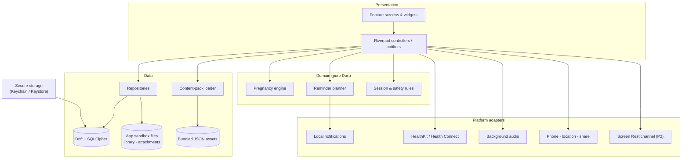
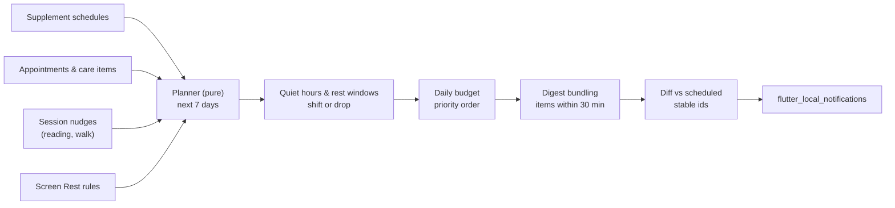
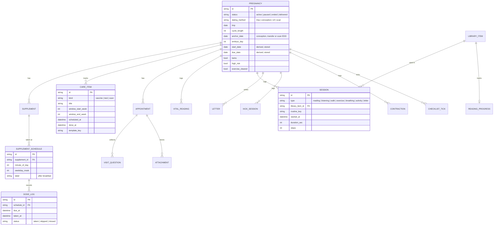

# Navmaas — Architecture Design

| | |
|---|---|
| **Status** | v1 — proposed 2026-10-04 |
| **Stack** | Flutter (stable) · Dart 3 |
| **Inputs** | [Plan](PLAN.md) · [Design system](DESIGN_SYSTEM.md) · [Prototype](https://claude.ai/artifact/SQRrhaQU7odSc5FLNeKcJ8) |

## 1. Context and constraints

| Constraint | Consequence for the design |
|---|---|
| Personal use, free | No accounts, payments, analytics or backend |
| Tracking aid, no medical reviewer | Domain logic records and reminds; it never interprets readings |
| Owner supplies Garbhasanskar content | In-app import of PDF, text and audio, stored on the device |
| Public MIT repository | Only original or public-domain content in `assets/`; no secrets in the repo |
| India, English only | `en` strings through `gen-l10n` (ready for more later); India care template; 108/102/112 numbers |
| Calm, low-screen product | Audio-first sessions, a notification budget, quiet hours, Screen Rest |
| Low-end Android phones | Small app size, no background polling in the MVP, offline-first |

**Non-functional targets**

- Cold start under 2 s on a 3 GB-RAM Android phone.
- Release APK under 30 MB.
- 100 % offline.
- No network calls.
- Every screen usable at 200 % text size and with TalkBack / VoiceOver.

## 2. Architecture at a glance



- **One Flutter app, no server.** All state lives in an encrypted SQLite database plus files in the app sandbox.
- **Domain is pure Dart.** The pregnancy engine and the reminder planner have no Flutter imports, so they are fast to unit-test.
- **Platform adapters sit behind interfaces**, so tests and the prototype flow can use fakes.

## 3. Tech stack

| Concern | Choice | Notes |
|---|---|---|
| Framework | Flutter stable, Dart 3 | Material 3 with custom tokens |
| State & DI | `flutter_riverpod` (+ `riverpod_generator`) | Compile-safe providers, easy overrides in tests |
| Navigation | `go_router` | `StatefulShellRoute` for the 5 tabs, keeping each tab's stack |
| Database | `drift` + `sqlcipher_flutter_libs` | Typed SQL, migrations, reactive streams, encrypted at rest |
| Secrets | `flutter_secure_storage` | Holds the random 256-bit DB key |
| Models | `freezed` + `json_serializable` | Immutable domain models and content-pack parsing |
| Notifications | `flutter_local_notifications` + `timezone` + `flutter_timezone` | Scheduled local reminders only, no push |
| Health | `health` | Steps and walking workouts via HealthKit and Health Connect |
| Audio | `just_audio` + `audio_service` | Background playback, lock-screen controls, sleep timer |
| Reading | `pdfrx` for PDF; built-in renderer for text/Markdown | EPUB is evaluated in P2 |
| Import | `file_picker`, `image_picker` | Books, audio, prescription photos |
| Device | `url_launcher` (tel:, maps), `geolocator`, `share_plus` | SOS calls, location sharing, backup export |
| Security | `local_auth` (optional app lock), `cryptography` (AES-GCM, Argon2id) | Attachment and backup encryption |
| Utilities | `intl`, `uuid` (v7), `collection` | |
| Lints & tests | `very_good_analysis`, `flutter_test`, `mocktail`, `integration_test` | Golden tests for light/dark |
| P2 | `home_widget`, platform channels (Swift / Kotlin) | Widgets; Screen Rest limits for other apps |

Package versions are pinned to the latest stable at project start and upgraded deliberately.

## 4. Project structure

Feature-first. Each feature has `data/` (repositories, table access), `domain/` (models, pure logic) and `presentation/` (screens, widgets, controllers).

```
pregnancy-care/
├─ lib/
│  ├─ main.dart
│  ├─ app/                 # NavmaasApp, router, theme-mode controller
│  ├─ core/
│  │  ├─ theme/            # tokens, ThemeData light/dark, NavmaasColors
│  │  ├─ db/               # drift database, tables, migrations, key handling
│  │  ├─ pregnancy/        # pregnancy engine (pure Dart)
│  │  ├─ reminders/        # planner (pure) + scheduler adapter
│  │  ├─ content/          # content-pack loader and models
│  │  ├─ platform/         # health, audio handler, screen-rest channel
│  │  └─ utils/            # clock, date-only maths, ids
│  ├─ features/
│  │  ├─ onboarding/
│  │  ├─ today/
│  │  ├─ journey/
│  │  ├─ sessions/         # library, reader, listen, letters, walk, exercise
│  │  ├─ care/             # supplements, vaccines & tests, visits, vitals
│  │  ├─ third_trimester/  # kick counter, contraction timer
│  │  ├─ safety/           # SOS, emergency card
│  │  ├─ screen_rest/
│  │  └─ settings/         # me, backup/restore, pause/end tracking
│  └─ l10n/app_en.arb
├─ assets/
│  ├─ content/             # weeks.json, care_template_in.json, routines.json, danger_signs.json
│  └─ fonts/               # Nunito, Literata (OFL)
├─ test/                   # unit + widget + golden
├─ integration_test/
├─ android/  ios/
├─ design/                 # navmaas-tokens.css (prototype tokens)
└─ docs/
```

## 5. Layers and state

- **Repositories** expose `Stream`s from Drift queries (`watch…`) and `Future` commands. Screens never touch the database directly.
- **Controllers** (`Notifier` / `AsyncNotifier`) combine repositories with domain logic for each screen. For example, `todayPlanProvider` merges supplement schedules, the session plan and the next appointment.
- **A `Clock` provider** wraps "now", so date-dependent logic (gestational age, reminders) can be tested with a fixed date.
- **Side effects** (scheduling notifications, Health reads, audio) go through adapter interfaces, overridden with fakes in tests.

## 6. Pregnancy engine

This is pure date-only maths on calendar dates in the device's time zone, with no `DateTime` time-of-day arithmetic, so it is safe across DST.

| Dating method | Pregnancy start (gestational day 0) |
|---|---|
| Last period (LMP) | `lmp + (cycleLength − 28)` days |
| Conception | `conception − 14` days |
| IVF, day-5 embryo | `transfer − 19` days |
| IVF, day-3 embryo | `transfer − 17` days |
| Due date from scan | `scanEdd − 280` days |

- **Due date** = start + 280 days.
- **Gestational age** = today − start → `weeks = ga ~/ 7`, `days = ga % 7` (shown as "24 weeks 4 days").
- **Trimester:** 1 for < 14 w, 2 for < 28 w, 3 otherwise (boundaries 13w6d / 27w6d).
- **Month (display):** `ga ~/ 30.44 + 1`, capped at 10, so 24w4d shows as "Month 6".
- **Edge cases:**
  - Gestational age below 0 or above 44 weeks prompts the user to review the dates.
  - Past the due date, the app shows "due date + N days".
  - A twins flag changes copy only.
  - Paused or ended pregnancies freeze the engine output.
- **Tests:** table-driven unit tests for every method, cycle lengths 21–40, leap years and month ends.

## 7. Reminder scheduler

Every notification goes through one place, so the calm rules always apply.



1. **Priority when over budget** (default 4 per day): appointments, then supplements, then care items, then session nudges. Extra items fold into one morning digest instead of being lost.
2. **Quiet hours / Screen Rest:** non-urgent reminders inside a window move to its end; nudges are dropped.
3. **Rolling window:** only the next 7 days are scheduled. iOS caps pending local notifications at 64, and 7 × 4 plus appointments fits comfortably.
4. **Re-planning triggers:** app start and resume, any change to a source table (Riverpod listeners), time-zone change, and device reboot (handled by the plugin's boot receiver).
5. **Stable ids** (a hash of source id + due time) let the scheduler cancel or replace exactly what changed.
6. **Android:** asks for `POST_NOTIFICATIONS` (13+). Uses inexact `inexactAllowWhileIdle` alarms; a few minutes of drift is fine for these reminders and avoids the exact-alarm permission.
7. **Actions:** supplement notifications have "Taken" and "Snooze 30 min" actions, which write a `DoseLog` without opening the app.

## 8. Data model

All tables use `id` (UUID v7, text), `created_at`, `updated_at` and a nullable `deleted_at` (soft delete). This keeps the schema ready for an optional sync later.



Tables not shown in detail:

| Table | Purpose |
|---|---|
| `profile` | Name, blood group, allergies, hospital, doctor and phone |
| `contact` | Emergency contacts |
| `supplement` | Name, dose text, notes, stock and refill threshold |
| `appointment` | Time, doctor, place, notes |
| `visit_question` | Optionally linked to an appointment |
| `attachment` | Encrypted file path and MIME type |
| `vital_reading` | Type, value(s), unit, time |
| `library_item` | Kind, title, relative file path, duration or pages |
| `reading_progress` | Position in a library item |
| `letter` | Letters to baby |
| `kick_session` | Kick-counter sessions |
| `contraction` | Start and end of each contraction |
| `screen_rest_rule` | Screen Rest windows and settings |
| `checklist_tick` | Ticked items from the weekly checklists |
| `settings` | Key-value: theme, daily limit, quiet hours, night reading, text size |

Migrations are versioned with Drift's `schemaVersion`, and every migration has a test.

## 9. Content

| Source | Where | Rules |
|---|---|---|
| Week-by-week notes, checklists, India care template, exercise routines, WHO danger signs | `assets/content/*.json`, versioned with `schemaVersion` | **Only original or public-domain text.** General information, no doses, no outcome claims. The danger-sign list cites WHO. |
| Garbhasanskar books (PDF / text) and audio | Imported in-app with `file_picker`, copied into `<app documents>/library/`; the DB stores the relative path | Never leaves the phone. Never committed to the repo. |

- `weeks.json` has one entry per week (4–42): size comparison, baby note, body note, checklist keys and trimester.
- Exercise routines carry `trimesters`, `durationSec` and `avoidIfHighRisk` flags. The Exercise screen filters on these and stays locked until "doctor cleared me" is on.

## 10. Platform integrations

| Capability | MVP behaviour | Platform notes |
|---|---|---|
| Steps & walks | Read today's steps; record walk sessions; optionally write a walking workout | iOS: HealthKit capability + usage strings. Android: Health Connect permissions + rationale activity; min SDK 26 |
| Background audio | Plays with the screen off and shows lock-screen controls; sleep timer | iOS `audio` background mode; Android media foreground service |
| "Screen off — keep listening" | Switches to a near-black overlay that wakes on tap, and lets the phone lock normally | No wakelock is held |
| SOS | `tel:108` / doctor / family through `url_launcher`; location from `geolocator` shared as a maps link through `share_plus` | Works offline (GPS + share sheet) |
| Emergency card | In-app card; P2 adds a lock-screen widget | — |
| Screen Rest (MVP) | In-app only: rest windows, foreground-time counter (`AppLifecycleListener`), eye-rest timer while reading | No special permissions |
| Screen Rest (P2) | Gentle limits on apps she picks | Android: `UsageStatsManager` + WorkManager (Kotlin). iOS: FamilyControls + DeviceActivity extension (Swift); the development entitlement is enough for personal installs |

## 11. Security and privacy

- **Network:** the app makes no network calls. Release Android builds omit the `INTERNET` permission, so data cannot leave the phone; debug builds keep it for hot reload. Fonts are bundled.
- **Database:** encrypted with SQLCipher. The 256-bit key is generated on first run and kept in Keychain / Android Keystore.
- **Attachments** (prescription photos, reports) are encrypted with AES-256-GCM. Imported books and audio stay as plain files in the app sandbox; they are the owner's own media, not health data.
- **Backup / restore:**
  - The backup is a ZIP of the DB, attachments and (optionally) the library.
  - It is encrypted with a key derived from a passphrase (Argon2id → AES-256-GCM) and saved through the share sheet.
  - A weekly reminder prompts a new backup.
  - Restore needs the passphrase.
- **Optional app lock** with biometrics or PIN (`local_auth`).
- **Deletion:** "Delete all data" wipes the DB, the files and the stored key.
- **Repository hygiene:** no keystores, `google-services` files or personal content in git. `.gitignore` covers `*.jks`, `key.properties` and `/library`.

## 12. Theming and accessibility

- Tokens from [DESIGN_SYSTEM.md](DESIGN_SYSTEM.md) become `ThemeData.light/dark`: a `ColorScheme` plus the `NavmaasColors` extension. `ThemeMode` is user-selected (Light / Dark / System).
- The reader has its own Paper / Night palette, switching to Night automatically after 9 pm if enabled.
- **Accessibility:**
  - `MaterialTapTargetSize.padded` and minimum 48 dp targets.
  - `Semantics` labels on icon-only buttons.
  - Text follows `MediaQuery.textScaler` and is tested at 1.0, 1.3 and 2.0.
  - Motion respects `MediaQuery.disableAnimations`.

## 13. Delivery milestones

| Milestone | Scope | Done when |
|---|---|---|
| **M1 Foundation** | Flutter project, lints, CI, theme + fonts, router with 5 tabs, Drift + SQLCipher, pregnancy engine, onboarding, settings | Onboarding stores a pregnancy; Today shows the correct week in light and dark |
| **M2 Today & Journey** | Content-pack loader, week ring, today's plan, Journey week picker, checklists, trimester progress | Golden tests pass for both themes |
| **M3 Care** | Supplements + reminder planner/scheduler, notification actions, India care template, visits + questions, vitals | Reminders respect budget and quiet hours in tests and on a device |
| **M4 Sessions** | Library import (PDF/text/audio), reader with timer + night mode, background audio + screen-off, letters, walk (Health), exercise routines | A 15-min reading and a 20-min walk are logged end to end |
| **M5 Safety & third trimester** | SOS, emergency card, location share, kick counter, contraction timer, pause/end tracking | Pause/end silences all baby content and reminders immediately |
| **M6 Screen Rest & release** | Rest rules, in-app usage counter, digest polish, backup/restore, accessibility pass, release builds | Signed APK; iOS build on device; restore tested from backup |

## 14. Testing and CI

- **Unit tests:** pregnancy engine, reminder planner (budget, quiet hours, bundling, 64-cap window), repositories on in-memory Drift, backup encryption round-trip.
- **Widget and golden tests:** key screens in light and dark at 1.0× and 2.0× text.
- **Integration tests:** onboarding → Today; take a supplement from a notification action; import a PDF and log a reading session.
- **GitHub Actions** (free for public repos), on every push and PR:
  - `dart format --set-exit-if-changed`
  - `flutter analyze`
  - `flutter test`
  - `flutter build apk --release` (uploaded as an artifact)
  - An iOS build job on a macOS runner can be added when needed.

## 15. Decision log

| ADR | Decision | Why |
|---|---|---|
| 001 | Flutter for iOS and Android | Team works in Dart; one codebase; full control of the custom calm UI |
| 002 | Local-first, no backend, no network | Personal use; maximum privacy; nothing to host or pay for |
| 003 | Drift + SQLCipher | Relational health logs, typed queries, migrations, encryption at rest |
| 004 | Riverpod + go_router | Testable DI and state; tab shells with preserved stacks |
| 005 | Feature-first folders with data / domain / presentation | Features stay independent; pure domain logic is easy to test |
| 006 | Owner-supplied content on device; repo holds only original or public-domain text | Public repo; no licensing exposure |
| 007 | Single reminder planner with budget, quiet hours and a rolling 7-day window | Calm by default; works within the iOS 64-notification limit |
| 008 | Bundle fonts instead of fetching at runtime | No network calls; works offline |
| 009 | Tracking aid only, plus a static WHO danger-sign list | No medical reviewer; keeps a minimum safety net |
| 010 | Encrypted backup file instead of cloud sync | Protects against phone loss without a backend |
